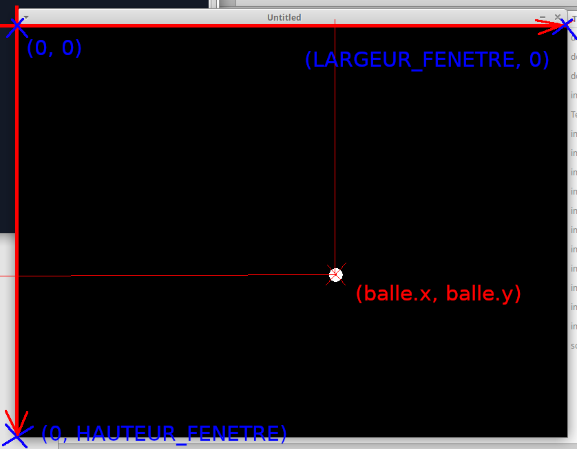

# Atelier 4 : Gérer les collisions

Dans un jeu il est essentiel de pouvoir traiter les contacts entre les différentes entités ou objets représentés à l’écran : personnage bloqué par des obstacles dans ses déplacements, choc entre personnages ou par exemple entre missiles et vaisseaux dans un shoot’em up, contact avec le sol dans un jeu de plate-formes, etc. Ces contacts peuvent être suivi d’effets qui différent en fonction du gameplay : rebond d’une balle, explosion d’un vaisseau, disparition d’un objet qu’on ramasse, recul d’un personnage qui s’est pris un coup, etc. Il y a de nombreuses manière de gérer les collisions en jeu, plus ou moins sophistiquées, plus ou moins gourmandes en calcul. Nous allons en voir quelques unes parmi les plus simples.

## Collision d’une balle avec le bord de l’écran (et rebond)

Si on veut programmer une balle qui avance dans une direction à l’écran, créons d’abord une table qui va nous permettre de stocker toutes les données liées à cette balle (ses « propriétés ») : position x et y, vitesse horizontale et verticale vx et vy, taille de la balle (son rayon r)…

```lua
balle = {}
balle.x = love.graphics.getWidth()/2
balle.y = love.graphics.getHeight()/2
balle.r = 10
balle.vx = 100
balle.vy = 100
```

Les fonctions `love.graphics.getWidth()` et `love.graphics.getHeight()` donnent respectivement la largeur et la hauteur de la fenêtre. 

Pour faire avancer la balle, il suffit de mettre à jour les coordonnées `x` et `y` de la balle en fonction des vitesses `vx` et `vy` dans la fonction `love.update()` (sans oublier le rôle de la variable `dt`)

```lua
function love.update(dt)
 
  balle.x = balle.x + balle.vx*dt
  balle.y = balle.y + balle.vy*dt
 
end
```

Et enfin il suffit de dessiner la balle avec la fonction `love.draw()` :

```lua
function love.draw()

  love.graphics.circle('fill', balle.x, balle.y, balle.r)
   
end
```

Si on lance ce programme, on se rend compte qu’assez rapidement la balle sort de l’écran : en effet elle va toujours dans la même direction. Tu peux d’ailleurs ajouter une ligne dans `love.draw()` pour afficher les coordonnées de la balle, nous avons vu précédemment la fonction qui permet d’afficher du texte dans la fenêtre de jeu.

Pour que la balle reste dans l’écran une méthode est de changer la direction de la balle quand ses coordonnées correspondent au bord de la fenêtre.

Par exemple, si `vy` est la vitesse verticale de la balle, si `vy` est > 0, alors la balle va aller vers le bas.

Donc dès que la coordonnée `y` de la balle est supérieure ou égale à celle du bord inférieur de la fenêtre, il faudrait inverser la vitesse verticale de la balle pour que la balle aille dans la direction opposée (vers le haut), comme pour un rebond. 

Pour connaître la taille (hauteur, largeur) de la fenêtre, on utilise les fonctions `love.graphics.getHeight()` et `love.graphics.getWidth()`. Nous allons souvent les utiliser. Pour faciliter l’écriture et la lisibilité du code, et éviter de les appeler à répétition, il vaut mieux, dès le début du programme, stocker ces valeurs dans des variables qu’on va considérer comme des constantes (on va les écrire en majuscule pour les reconnaître) :

```lua
HAUTEUR_FENETRE = love.graphics.getHeight()
LARGEUR_FENETRE = love.graphics.getWidth()
```

Ensuite il suffit de tester la valeur de `balle.y` pour savoir si elle est supérieure ou égale à la valeur de `HAUTEUR_FENETRE` que l’on vient de calculer, et si cette condition est vraie, d’inverser la valeur de `balle.vy` en la multipliant par -1 :

```lua
function love.update(dt)

  if balle.y >= HAUTEUR_FENETRE then
		balle.vy = -1 * balle.vy
  end
  
  balle.x = balle.x + balle.vx*dt
  balle.y = balle.y + balle.vy*dt
 
end
```

Il est très important pour comprendre cet algorithme de bien avoir à l’esprit le système de coordonnées de la fenêtre de jeu. L’origine, le point de coordonnées (0, 0), est le coin haut gauche de la fenêtre, et l’axe des x va de gauche à droite (x = 0 correspond au bord gauche, et les x augmentent quand on va vers la droite), mais l’axe des y est inversé par rapport à la convention ordinaire : y = 0 correspond au bord du haut, et les y augmentent quand on va vers le bas de la fenêtre.



Pour faire rebondir sur les autres bords de la fenêtre on va procéder exactement de la même manière : inverser `balle.vx` quand la balle atteint le bord droit ou le bord gauche, et inverser `balle.vy` quand la balle atteint le haut de la fenêtre.

Tu as tout ce qu’il faut pour écrire un programme où la balle rebondit sur les 4 bords de l’écran.

Essaye !

Plutôt qu’un rebond, on peut attacher un autre événement à ces situations. Par exemple dans le jeu Pong, alors que la balle rebondit bien sur les bords haut et bas de la fenêtre, ce n’est pas la même chose pour les bords droit ou gauche : dans ces cas la balle disparait, rapporte un point au joueur du bord opposé, et est remise en jeu. Mais du point de vue de la programmation, les conditions testées sont identiques, c’est juste les conséquences (le code exécuté après le `then`) qui sont différentes.

Enfin, si on regarde bien ce qu’il se passe à l’écran, ce n’est pas parfait. La balle rebondit, mais on voit qu’à chaque rebond, il y a au moins la moitié de la balle qui sort de l’écran. C’est parce que l’on teste la position x et y de la balle, qui correspond en fait au centre de la balle : nous avons oublié dans nos tests que la balle a une épaisseur.

Comment doit-on modifier nos tests pour prendre en compte l’épaisseur de la balle ?

Par exemple pour notre test sur le bas de l’écran, il faudrait ajouter le rayon r de la balle à la coordonnée y (regarde la figure ci-dessous pour bien comprendre) :

```lua
if balle.y + balle.r >= HAUTEUR_FENETRE then
		balle.vy = -1 * balle.vy
  end
```


Modifie toutes les conditions de ton programme pour avoir un rebond dès que le bord de la balle touche les bords de la fenêtre. Attention, il y a une différence quand la balle touche les bords gauche et haut, et les bords bas et droite… fait un dessin au préalable pour bien déterminer la condition à tester.

## Collision entre éléments : détecter si une raquette renvoie une balle

## Tester si on a cliqué sur un sprite

## Technique des « bounding boxes »

## Technique des « hot spots »
