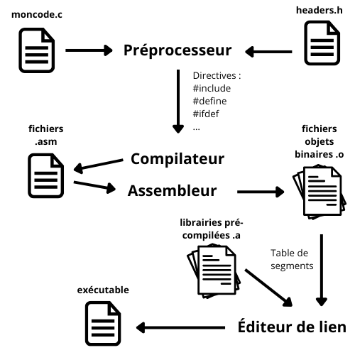

# Créer un Pacman en C

Pour s’initier à la programmation en C, je vous propose de créer un jeu d’arcade, parmi les classiques : un Pacman.

Vu qu’il s’agit d’une initiation au C, on va rester simple : pas de bibliothèque graphique, pas de SDL, pas de Raylib pour le moment… on va tout faire dans la console/terminal, les sprites seront représentés par des caractères ! Mais en utilisant une bibliothèque qui nous permet de contrôler un peu l’affichage dans le terminal, en tout cas beaucoup plus qu’avec juste la bibliothèque standard.

Note : cet atelier n’est pas un cours d’initiation à la programmation. Il est attendu que vous ayez déjà programmé dans un autre langage que le C, car l’idée est plutôt de vous permettre de transférer vos connaissances en programmation dans ce langage en découvrant sa syntaxe – tout en vous faisant découvrir quelques unes de ses spécificités.

Nous n’aborderons pas dans cet atelier les notions avancées comme les pointeurs, la gestion de l’allocation mémoire, etc. Ce sera l’objet d’un atelier suivant sur le C. Ici nous découvrirons de manière ludique les types du C (comme les tableaux, la gestion des caractères et des chaînes de caractères…), la syntaxe (les boucles, les structures de contrôle, etc.), les *includes* (analogues aux imports en Python), mais aussi le processus de compilation et notamment l’outil `make`, ce qui est déjà beaucoup pour une introduction.

Au cas où, voici un cours qui m’a semblé très bien fait sur le C : https://zestedesavoir.com/tutoriels/755/le-langage-c-1/

## Mise en place

### Installer `ncurses` (Linux)

Le C étant un langage de plutôt bas-niveau, la portablité des programmes faisant appels à certains mécanismes des systèmes  (affichage, terminal…) est assez complexe. Ainsi si l’on veut faire appel à des fonctions élaborées ne serait-ce qu’au niveau de la console, il faut installer des bibliothèques spécifiques : `conio` sur Windows et `ncurses` sur Linux. Bien sûr elles ne sont pas interopérables (un programme écrit pour l’une ne marchera pas pour l’autre).

Dans cet atelier nous ne traiterons que du cas Linux, soit avec `ncurses`. Voilà déjà comment l’installer (Debian et dérivée : Ubuntu, etc.) :

```bash
$ sudo apt update
$ sudo apt install libncurses5-dev libncursesw5-dev
```

Normalement, sous Linux, vous devriez avoir ce qu’il faut pour compiler du code C (compilateur `gcc`, etc.), mais nous vérifierons ensemble au début de l’atelier.

### Installer un environnement Linux sous Windows

Si vous êtes sous Windows, lancer powershell, et rentrez la commande :

```powershell
wsl --install
```
Ceci installera une Ubuntu sur votre machine. Vous aurez ainsi accès à un terminal sous Linux, ce qui est exactement ce qu’il faut pour suivre cet atelier (lancez Ubuntu et installez ensuite dans ce terminal `ncurses` comme indiqué ci-dessus). Nous verrons ensemble si `wsl` demande d’autres ajustements pour compiler du code C, et au pire il y a d’autres outils pour disposer d’un environnement de développement compatible Linux sur Windows.

Dans le terminal vous pouvez lancer l’environnement Linux juste avec la commande `wsl`. Une fois que vous y êtes, on va procéder à la mise à jour (souvent nécessaire quand on vient d’installer le système), et installer le compilateur `gcc` :

```bash
$ sudo apt update # met à jour la liste des packets téléchargeable, pouvant être mis à jour
$ sudo apt upgrade # met à jour les paquets
$ sudo apt install gcc # installe le compilateur gcc
```

### Créer un `Makefile`

#### La théorie

Le langage C est un langage compilé, ce qui le distingue des langages interprétés comme le Python, le Javascript, etc. Un langage interprété est exécuté par un programme appelé interpréteur, qui traduit au fur et à mesure et en direct les instructions qu’il y a dans le programme. Pour les langages compilés au contraire, un programme appelé compilateur traduit une fois pour toute les instructions en langage machine, pour créer un exécutable. Celui-ci est distinct du fichier dans lequel on a écrit le programme et est illisible par un humain. Par contre il s’exécute beaucoup plus rapidement car il n‘y a pas d’intermédiaire entre les instructions et leur exécution. Cela rend ces programmes très puissants, mais relativement compliqués à écrire, et parfois dangereux (à l’origine de gros plantages).

La compilation est un processus complexe, en plusieurs étapes. Pour éviter d’alourdir l’atelier, vous trouverez sa description plus complète en annexe. Pour le moment il suffit de retenir qu’il s’agit de lancer une commande qui va transformer notre programme en exécutable. Par exemple en supposant que `moncode.c` est un fichier écrit en C, on peut le compiler en un exécutable que l’on peut appeler `monexecutable` avec `gcc` qui est le compilateur de référence sur Linux (mais il en existe d’autres) :

```console
$ gcc moncode.c -o monexecutable 
```

On peut écrire aussi :

```console
$ gcc -o monexecutable moncode.c  
```

L’option `-o` sert à donner le nom que l’on veut à l’exécutable, sinon il sera nommé `a.out` par défaut.

On peut ensuite lancer l’exécutable ainsi :

```console
$ ./monexecutable
```

Note : le terminal refusera – par sécurité – de lancer directement le fichier en rentrant la commande `monexecutable`, il faut bien préciser qu’on lance le fichier présent dans le dossier courant avec `./`

Dès qu’on utilise des bibliothèques, que notre code est réparti en plusieurs fichiers, et également parce qu’on peut demander beaucoup [d’options](https://gcc.gnu.org/onlinedocs/gcc-14.2.0/gcc/Option-Summary.html) de compilation à `gcc`, la ligne de commande pour compiler va être rapidement assez longue à écrire, et comme on compile souvent durant le développement (on va tester notre code souvent), on va chercher à automatiser tout ça. On va donc écrire un script qui va lancer la compilation : le `Makefile`, ce script sera interprété par la commande `make`.

Plus concrètement :

On va créer un fichier `Makefile` :

```makefile
CFLAGS=-Wall -g

test:
	gcc $(CFLAGS) moncode.c -o monexecutable 

clean:
	rm -f monexecutable
```

Si on lance la commande `make test` alors le script va produire un fichier exécutable nommé `monexecutable`, en exécutant la ligne `gcc…`

Si on lance la commande `make clean` alors le script va effacer (irrémédiablement) le fichier nommé `monexecutable` avec la commande `rm…`.

Vous l’aurez compris, un Makefile permet de préparer/stocker des suites de commandes que l’on pourra appeler lorsque nécessaire par un simple mot clef.
La première ligne du Makefile sert à préciser des options par défaut du compilateur. Ici `-Wall` signifie qu’on demande à ce que tous les *warnings* soient affichés durant la compilation, et `-g` que des informations de débuggages puissent être générées (qui pourront être exploitées par des outils comme `GDB`). Ensuite, quand on lance le compilateur, on lui dit de récupérer ces options avec `$(CFLAGS)`. Dans la console vous verrez les lignes de commandes qui sont lancées par `make`. 

On pourrait aussi, dans le même ordre d’idée, stocker le nom du compilateur dans une variable `CC` les appels se feraient ainsi :

```makefile
CFLAGS=-Wall -g
CC=gcc

test:
	$(CC) $(CFLAGS) moncode.c -o monexecutable
```

On peut ainsi changer facilement de compilateur si on le souhaite.

Les Makefiles peuvent être très longs et très compliqués, avec des pages et des pages de conditions à tester et d’options à choisir en fonction par exemple de la machine sur laquelle le programme est compilé, où alors de l’étape à laquelle on en est d’un projet. Ces scripts servent à adapter la compilation au contexte. Dans notre cas le Makefile sera beaucoup plus simple, mais déjà bien pratique néanmoins.

#### La pratique

1. Créons un premier programme, que l’on va compiler avec un Makefile que vous écrirez. Donnez-lui le nom que vous voulez, mais qui finisse par l’extension ```.c```. Bien sûr, remplacez la chaîne de caractère par le message que vous voulez écrire.

```C
#include <stdio.h>

int main(void) {
    printf("On va coder un Pacman !");
    return 0;
}
```

Expliquons un peu ce code :

* La première ligne : le `#include` est une instruction pour le préprocesseur. Le préprocesseur intervient avant la compilation : il modifie un peu le programme que l’on a écrit pour rendre sa compilation possible. Par exemple on peut s’en servir pour définir des constantes, ou comme ici indiquer que l’on veut faire appel à la bibliothèque (qu’ici on appelle *header*, d’où l’extention `.h`) pour les entrées/sorties standard (grosso modo dans la console). En effet plus on est de bas niveau, plus il faut expliciter de choses. Ici on veut écrire des choses dans la console, il faut donc incorporer les bouts de codes qui permettent d’écrire dans la console. C’est pour ça qu’un exécutable issu du C est assez léger, car il ne contient que le strict nécessaire.

* `int main(void)` : `main()` est la fonction principale de notre programme (un peu comme `__main__` en Python). Le `int` juste devant signifie que cette fonction retournera un entier quand elle sera exécutée. En effet, d’une part en C il est obligatoire d’expliciter quel type de variable une fonction va retourner, et d’autre part c’est une convention que lorsqu’un programme s’exécute correctement, il retourne la valeur 0. S’il rencontre une erreur durant son exécution, il peut retourner la valeur 1, ou une autre valeur selon l’erreur rencontrée. Le `void` signifie que cette fonction ne prend aucun argument en entrée.

* Les lignes avec les `printf()` et `return` sont assez compréhensibles. Notez juste le `;` à la fin : toutes les lignes d’instruction en C finissent par un point-virgule. Oubliez-le et le compilateur va vous insulter (ce qui arrivera souvent au début… et même plus tard). Le `return 0;` indiquera comme nous l’avons dit précédemment qu’il s’est terminé correctement (=sans erreur). En effet, on est arrivé à la fin du (très court) programme, et donc si on en est là c’est qu’il n‘y a pas eu d’erreur avant, donc on peut retourner la valeur 0. Plutôt que 0, on peut retourner si on inclut la bibliothèque `stdlib.h` la constante `EXIT_SUCCESS` qui prendra automatiquement la valeur désirée pour le système. Modifiez le programme pour essayer.

* On note aussi les `{}` : tout ce qui est entre accolades forme un *bloc*. En Python on utilise l’indentation pour délimiter les blocs, en C on utilise les accolades. Elles ne sont pas suivies d’un point-virgule.

2. Maintenant que vous avez votre fichier de code, créez un `Makefile` qui permet de le compiler. Puis lancer l’exécutable pour tester.

3. Créez un bloc `test` dans le `Makefile` qui compilera le fichier (vous pouvez pour cela faire référence à une autre section dans le `Makefile`), puis le lancera. 

4. Essayez de compiler plusieurs fois votre programme. Créez donc une section `clean`

5. Si vous avez le temps, regardez d’autres `Makefile` (sur le net, sur Github, etc.). Essayez de comprendre ce qu’ils font.

Note : en réalité, vous pouvez même utiliser `make` pour compiler votre programme sans `Makefile`. Avec un fichier `moncode.c` :

```console
$ make moncode
```

Dans ce cas `make` va voir qu’il n’y a pas de `Makefile`, donc pas d’instructions correspondantes à `moncode`. Il va constater aussi qu’il n‘y a pas de fichier exécutable de ce nom. Par contre il va voir qu’il y a un fichier avec l’extension `.c` qui porte ce nom. Il sait qu’il peut compiler des fichiers C, et comment. Il va donc compiler ce fichier avec une commande par défaut la plus simple : `gcc moncode.c -o moncode` 

Néanmoins, il vaut mieux toujours créer un `Makefile`, qui permet d’avoir un meilleur contrôle, surtout quand on fait des programmes plus complexes (qui font appel à des bibliothèques externes, etc.).

#### Un `Makefile` pour notre projet

Dans ce projet on aura un seul fichier (dans un premier temps) pour le jeu, et on utilisera juste la bibliothèque `ncurses` pour l’affichage dans la console.

Voilà donc une base de `Makefile` pour se faciliter la vie dans la compilation du projet :

```makefile
CFLAG=-Wall -g

pacman:
    gcc -o pacman pacman.c -lncurses

clean:
    rm -f pacman
```

Quand on fait appel à une bibliothèque partagée pré-compilée (quand on a installé `ncurses` avec `apt`, on l’a installée dans un répertoire spécifique, accessible à tous les programmes) on l’appelle avec le *flag* `-l` accolé au nom de la bibliothèque. Donc `-lncurses` dans notre cas. Attention, on ne peut l’appeler que dans un ordre précis, ici en dernier (il faut avoir généré les fichiers objets avant de l’appeler, voir l’annexe sur la compilation pour apprendre ce que sont des fichiers objets).

### À la découverte de `ncurses`

Nous avons installé cette bibliothèque, c’est pour s’en servir, non ? Maintenant que nous avons tout mis en place (`Makefile`, etc.), testons-la !

Créez un fichier `test-ncurses.c` :

```C
#include <ncurses.h>
#include <stdlib.h>

int main(void)
{
    initscr();
    
    printw("Test : ncurses fonctionne !\nAppuyer sur une touche pour quitter ");

    refresh();

    getch();

    endwin();

    return EXIT_SUCCESS;
}
```

Quelques explications ?

1. On commence par inclure la bibliothèque `ncurses.h`. Cela rend superflue l’inclusion de `stdio.h` qui est inclue dedans

2. `initscr()` est une fonction qui initialise la structure `WINDOWS` (la structure est un type de donnée en C qui ressemble à un dictionnaire) et d’autres paramètres qui permettent de gérer la fenêtre/console

3. Avec `printw()` on écrit des caractères dans cette fenêtre, à la position du curseur

4. `refresh()` procède à un rafraîchissement de la fenêtre, en mettant à jour ce qui a été modifié dans celle-ci (p. ex. l’affichage d’un message)

5. `getch()` sert à attendre l’appui d’une touche

6. `endwin()` comme son nom l’indique, ferme la « fenêtre » et restaure les paramètres du terminal qu’on avait quitté pour lancer le programme

7. Vu qu’on quitte, et si on en est là c’est que tout s’est passé correctement, on retourne le code correspondant à une sortie sans erreur (a priori 0)

Et voilà ! Si vous voulez jeter un œil à d’autres fonctions ou avoir d’autres explications sur celles que nous avons utilisées, voilà une [cheatsheet](https://thenamankumar.github.io/ncurses-cheatsheet/), et bien sûr [la doc](https://www.gnu.org/software/guile-ncurses/manual/html_node/index.html). Voilà également [un site](https://tldp.org/HOWTO/NCURSES-Programming-HOWTO/index.html) qui explique de manière très claire et progressive cette bibliothèque.

Vous pouvez aussi rajouter des lignes au `Makefile` pour compiler et lancer spécifiquement ce programme qui servira à tester que ncurse est bien installée et fonctionne (appelez la section `test-ncurse:` par exemple).

Une fois ce programme lancé, vous constaterez que comme notre premier programme il affiche quelque chose dans la console, mais vous voyez qu’il permet de tout effacer, d’afficher le message quelque part dans la fenêtre, de réagir à l’appui d’une touche sur le clavier, et de revenir à l’état dans lequel était le terminal avant le lancement du programme.

Ce qui nous amène à un point relativement important : si le programme plante (et ça risque d’arriver pendant le développement d’un jeu) on risque de ne pas retrouver les paramètres d’origine du terminal, le rendant inutilisable (rien ne s’affichera quand on tapera sur le clavier, etc.). Deux options : 

1. on ferme le terminal et on le relance (efficace mais pas élégant)
2. on se crée un script de récupération des paramètres du terminal

Cette deuxième option est proposée par Arnaud Feltz dans son [tutoriel sur `ncurses`](https://arnaud-feltz.developpez.com/tutoriels/ncurses/?page=premier_pas), que je vous invite bien sûr à parcourir (d’autant que nous nous contenterons d’utiliser seulement les fonctions qui sont utiles pour notre jeu, cet atelier n’étant pas un atelier `ncurses`).

Pour ce faire, il propose de créer le fichier suivant sous le nom que vous voulez (`sos` est pas mal) :

```bash
#!/bin/sh

stty -raw # réutilise le mode RAW pour l’interception des signaux et autres
stty echo # remise en place de l’echo
stty onlcr # remise en place du retour chariot
```
Rendez ce script exécutable avec la commande :

```console
$ chmod +x sos
```

Si d’aventure votre programme ne remet pas le terminal en ordre quand il quitte, et que vous ne voyez plus ce que vous écrivez, restez calmes et tapez juste (à l’aveugle) `./sos` (d’où l’intérêt de choisir un nom court) et tout reviendra dans l’ordre (devrait). Testez ce script pour voir s’il s’exécute sans erreur quand tout va bien, avant d’en avoir besoin : ce sera trop tard quand le terminal sera en carafe pour se rendre compte que le fichier ne s’exécute pas correctement ;)

Maintenant vous pouvez vous amuser à tout casser dans le programme test (supprimer des commandes, etc.) pour bien voir ce que fait chaque fonction.

## C’est bien beau, mais moi je voulais un Pacman !

Ok, ok.

Pour commencer, et découvrir le langage C et les autres fonctions de `ncurses`, commençons par créer la boucle de jeu dans la fonction principale.

Commencez par créer un fichier `term-pacman.c` et dans les première lignes, inclure les deux headers qui vont nous servir. Quels sont ces *headers* à votre avis ?

### Boucle de jeu

Nous allons devoir créer notre boucle de jeu à la main, la boucle de jeu étant la suite (cyclique) d’instruction qui fait « tourner » notre jeu.

Notre fonction principale `main()` va, dans l’ordre, du moment que le jeu est lancé :

1. Initialiser la console/écran

2. Initialiser le jeu : seulement créer le labyrinthe pour le moment, mais à terme il faudra qu’il positionne le joueur, les fantômes, la nourriture…

3. Donner des instructions au joueur (écran de menu…)

4. Attendre puis lancer la partie si le joueur l’ordonne (ou quitter)

5. Lancer la boucle de jeu : tant que le joueur n’a pas abandonné (quitté), gagné ou perdu, on reste dans le jeu c’est à dire qu’on affiche le labyrinthe, on teste le clavier, et on update le jeu en fonction des touches enfoncées… et on recommence. Pour le moment on va juste afficher le jeu tant que le joueur ne quitte pas

7. Arrêter le jeu si le joueur quitte.

#### Déclaration des fonctions

Nous allons donc, dans un premier temps, créer les fonctions suivantes, que nous allons laisser vides. Toutes ces fonctions vont agir sur la variable globale `labyrinthe` (en fait le contenu de notre écran de jeu, que nous déclarerons et définirons plus tard), la plupart ne prendront donc pas d’argument et ne renverrons rien, sauf `update()` qui va avoir besoin de recevoir la touche enfoncée par le joueur pour mettre à jour sa position selon ses mouvements :

```C
void init_jeu(void)
{

}

void update(char t)
{

}

void draw(void)
{

}
```

Si ces fonctions ne font rien, cela ne nous empêche pas de créer le squelette de notre fonction `main()` qui pourra les appeler. Nous les enrichirons ensuite, une fois que nous avons une boucle avec un jeu qui se lance, et qu’on peut quitter.

#### Initialisations

Dans `main()` on va appeler deux fonctions pour initialiser l’écran : `initscr()` que nous avons déjà vue, et `noecho()` qui va empêcher que lorsque l’on appuie sur une touche, le caractère correspondant soit affiché dans la console. En effet, on va utiliser les touches du clavier pour déclencher des actions dans le jeu (lancer la partie, quitter, déplacer le sprite…), il serait malvenu que chaque appui sur une touche affiche des choses dans la console.

Ensuite appeler la fonction `init_jeu()` (même si elle est encore vide pour le moment), qui préparera le lancement du jeu, quand nous l’aurons écrite.

Je vous conseille de tester/compiler le programme fréquemment, même s’il ne fait rien, ne serait-ce que pour détecter les erreurs de pure forme (syntaxe…). En effet les erreurs sont difficiles à détecter, et le compilateur peut être assez chatouilleux. Si vous écrivez beaucoup de lignes de code, vous risquez d’avoir beaucoup d’erreurs et le débuggage sera sinon difficile, au moins fastidieux.

#### Menu

On  va ensuite créer un menu minimaliste : on affiche des instructions, on attend l’appui d’une touche qui va provoquer soit le lancement de la partie, soit l’arrêt du jeu.

6. Afficher les instructions (en une phrase) qui invitent à appuyer sur une touche (au hasard, `j` comme « jeu »), et à quitter le jeu en appuyant sur tout autre touche.
7. Tester l’appui sur une touche
8. Quitter ou entrer dans la boucle de jeu selon le résultat.

Nous connaissons la fonction pour afficher du texte avec `ncurses`.

Nous connaissons également la fonction pour tester l’appui sur une touche. Mais cette fois elle doit nous permettre d’identifier une touche avec précision.

Cette fonction, `getch()`, retourne un type `char` (un caractère qui correspond à la touche). Nous devons donc déclarer une variable de ce type qu’on va appeler `touche`, dans laquelle nous allons stocker le résultat de la fonction `getch()`.

On va donc écrire :

```C
char touche = getch()
if (touche !='j' && touche !='J')
    {
        endwin();
        return EXIT_SUCCESS;
    }

```

Voilà, vous savez comment on écrit une structure `if…` en C. `&&` est l’opérateur logique ̀`AND`. C’est l’occasion aussi de revenir sur un mécanisme important en C et que nous avons quelque peu occulté : la déclaration.

Toute variable doit être, avant toute autre opération, déclarée en C. C’est à dire que l’on va demander de réserver un espace mémoire où l’on pourra stocker une valeur. Et la taille de l’espace réservé va dépendre du [type](https://fr.wikibooks.org/wiki/Programmation_C/Types_de_base#cite_ref-:0_4-0). Par exemple un entier en C, `int`, occupera 4 octets (32 bits) en mémoire sur les ordinateurs de bureau courants (notez que cela peut être différent sur des machines moins puissantes, avec juste des processeurs 16 bits par exemple). Donc quand on écrit `int a` cela signifie que l’on réserve 4 octets en mémoire, accessibles par la référence `a`. Et on pourra stocker des valeurs entières à cet emplacement mémoire (une série de 32 chiffres 0 et 1 qui seront interprétés comme formant un entier) en réalisant une affectation, par exemple : `a = 45`. Comme cela représente un espace limité de 4 octets, on ne pourra stocker que des valeurs entières comprises entre -2<sup>31</sup> (soit -2 147 483 648) et 2<sup>31</sup>-1 (soit 2 147 483 647). Si on cherche à stocker autre chose à cet emplacement (du texte, des nombres à virgules…) ça va mal se passer, le compilateur refusera de compiler.

Par exemple vous pouvez essayer de compiler ce code (créez un autre fichier `test.c`, compilez-le (vous vous rappelez de la commande pour compiler ?) et lisez le message d’erreur) : 

```C
int main(void){
    int a;
    a = 'Cette phrase ne va pas passer.';
    return 0;
}
```

Note : C’est une situation assez différente de ce qui se passe en Python par exemple, ou la déclaration est implicite. Si on écrit `a = 1` en Python, l’interpréteur va réserver un espace en mémoire où il va mettre la valeur 1, et `a` sera une référence vers cet espace mémoire. Si on écrit ensuite `a = "c’est une phrase"`, alors il va placer `"c’est une phrase"` dans un autre espace mémoire, et `a` sera désormais une référence vers cet autre espace mémoire. Ce n’est pas tant la valeur de `a` qui change que l’endroit en mémoire vers lequel elle pointe. En C c’est beaucoup plus rigide : `a` est en quelque sorte le nom d’un endroit précis réservé en mémoire, qui ne changera jamais (à moins d’utiliser des fonctions spéciales), et dans lequel on ne peut mettre que ce qu’on a dit qu’on y mettrait. C’est aussi ce qui rend le C si rapide : chaque variable n’occupe que la place qui lui est réservée dans des espaces contigus dont la taille est prévisible, et il n‘y a, après la compilation, aucun mécanisme de vérification (comme un ramasse miette tel celui du Python).

Cette parenthèse sur la déclaration refermée, il nous suffit ensuite de tester dans notre programme la valeur de `touche` et quitter si la touche n’est pas celle indiquée pour démarrer le jeu.

En quittant notre fonction `main()`, ne pas oublier de réinitialiser la console proprement (avec `endwin()`) et de retourner la valeur qui indique que tout s’est bien passé (`EXIT_SUCCESS`).

Testez que ce programme s’arrête bien quand vous appuyez sur les touches voulues.

#### La boucle de jeu

Nous allons utiliser une boucle `while` pour implémenter la boucle de jeu :

```C
while(1)
{

}
```

Cette boucle va tourner à l’infini vu que la condition `1` est toujours vraie.

Note : le type booléen n’existe pas en C. On va utiliser des entiers pour coder les valeurs booléenne. `true` sera codé par 1 (et en fait toute autre valeur que 0), `false` par 0. Depuis la version C99 du C, on peut utiliser formellement les mots clefs `true` et `false` en incluant le *header* `stdbool.h`. Mais « sous le capot » ces mots clefs sont remplacés par les valeurs `0` et `1` lors de la compilation (avec un `#define`).

Dans cette boucle on va :

1. Appeler la fonction `draw()` pour afficher les éléments du jeu (labyrinthe) après mise à jour. On va appeler cette fonction en premier car c’est aussi elle qui nettoie l’écran, et donc ça assurera une transition immédiate dès que l’on aura quitté le menu
2. Une nouvelle fois on stocke la valeur de la touche enfoncée (qui cette fois servira à contrôler le personnage joueur) dans la variable `touche`
3. Selon la valeur de cette variable, on va quitter (si `'q'` a été enfoncée) ou appeler la fonction `update()` qui va mettre à jour la position du joueur, des fantômes, les scores, etc. On lui transmettra donc la variable `touche` (sans se préoccuper de sa valeur, ce sera l’affaire de la fonction `update()` de voir ce qu’elle en fait)

Toute les fonctions et syntaxes étant connues, cela ne devrait pas vous poser de difficulté d’écrire cette boucle `while`, même si les fonctions `draw()`et `update(touche)`sont encore vides pour le moment : l’idée est d’écrire la structure du programme au fur et à mesure. Vous aurez juste besoin d’une structure `if… else…` que nous n’avons pas encore vu :

```C
if ( <condition>)
{
    <instructions>;
}
else
    <instruction>;
```

On voit ici que dans le bloc du `else` si on n’a qu’une instruction sur une ligne, on omet les accolades. On a besoin des accolades pour rassembler plusieurs lignes d’instructions dans un même bloc.

N’oubliez pas lorsque vous quittez (la seule chose que pour le moment votre programme permettra de faire), de le faire proprement (réinitialiser la console, retourner une valeur de sortie sans erreur). Vous pouvez au préalable afficher un message de fin si vous le souhaitez, ou demander encore la confirmation par un appui sur une touche.

Testez votre programme, même s’il ne fait pas encore grand chose.

Nous allons remédier à ce vide en nous occupant maintenant des autres fonctions : initialiser le jeu, dessiner le jeu et, bien sûr, faire la mise à jour du jeu (update).

### Initialisation du jeu : création du labyrinthe

Nous allons d’abord créer cette fonction `init_jeu()`. Revenons en tout premier lieu au début du fichier, juste après les `#include`. On va définir deux constantes globales qui vont représenter la hauteur et la largeur du labyrinthe, ainsi que quelque éléments graphiques :

```C
// dimensions du labyrinthe
#define LARGEUR 60
#define HAUTEUR 20

// éléments graphiques du labyrinthe
#define MUR '#'
#define VIDE ' '
```

Attention, il ne s’agit pas de variable au sens strict (pas d’affectation avec `=`, pas de `;` en fin de ligne), mais une instruction pour le préprocesseur qui va bêtement et simplement remplacer tous les `LARGEUR`qui apparaissent dans le code par `60` par exemple.

On remarque à cette occasion que les commentaires sur une ligne sont annoncés par les caractères `//`. Les commentaires sur plusieurs lignes sont délimités par les suites de caractères `/*` au début et `*/` à la fin. Par exemple :

```c
/* Ceci
est un commentaire
sur plusieurs lignes */
```

Ensuite on va déclarer une variable globale qui est un tableau à deux dimensions, c’est à dire une liste de listes, comme vous avez certainement déjà vu en Python. Par contre le type liste, ou plus exactement table à une dimension, est assez différent en C de ce que vous connaissez en Python, on va le voir plus en détail ci-dessous. Ce tableau va représenter notre labyrinthe et les choses qu’il contient (notre écran de jeu en somme). Il ne contiendra que des caractères vu qu’on va représenter tous les éléments graphiques de notre jeu avec des caractères. Pour déclarer un tableau en C on a besoin de deux choses :

* le type de données que l’on va mettre dans notre tableau (ou seulement des entiers, ou seulement des flottants, ou seulement des caractères, etc.)
* la taille du tableau

En effet vu qu’on va réserver un espace en mémoire adapté à notre tableau, il faut pouvoir précisément savoir combien de place il va prendre. On a donc besoin de connaître les dimensions du tableau, et la taille de ce qu’on va mettre dedans. Cela signifie aussi qu’en C le tableau est une structure rigide : on ne peut pas modifier sa taille. Pour avoir un peu plus de souplesse il faut être capable de gérer la mémoire dynamiquement, d’où les concepts qu’on verra dans d’autres ateliers à venir : l’allocation dynamique de la mémoire, les pointeurs, les adresses, etc.

Pour faire cette déclaration :

```C
char labyrinthe[HAUTEUR][LARGEUR];
```

Rappelez-vous : par convention on traite toujours les tableaux (matrices…) dans le sens lignes/colonnes. Et c’est la hauteur d’un tableau qui définit le nombre de lignes, et la largeur le nombre de colonnes. Ensuite la taille d’un tableau est fixe en C, ici `HAUTEUR`et `LAGEUR` ne sont pas des variables, mais des constantes. Vous remarquerez qu’on déclare le tableau avec le type de ce qu’il contient (ici des caractères), et non comme un type particulier en soit (qui aurait pu être liste, ou array, ou table…)

Notre tableau sera une variable globale, située en dehors (avant) de la fonction principale `main()` (et des autres fonctions). Toutes les fonctions y auront donc accès.

La création du labyrinthe, qui ne va pas changer au cours du jeu, sera effectuée dans une fonction `init_jeu()` qui ne prendra pas d’argument vu que `labyrinthe` est une variable globale qu’elle va modifier directement.

On va y parcourir le tableau dans le sens lignes/colonnes. C’est-à-dire d’abord dans le sens de la hauteur, puis avec une boucle imbriquée, dans le sens de la largeur. 

```C
void initialize(void){
    // murs extérieurs du labyrinthe
    for (int i = 0; i < HAUTEUR; i++)
    {
        for (int j = 0; j < LARGEUR; j++)
        {
            if (i == 0 || i == HAUTEUR - 1 || j == 0 || j == LARGEUR - 1)
            {
                labyrinthe[i][j] = MUR;
            }
            else
                labyrinthe[i][j] = VIDE;
        }
    }
 } 
```

Note : **important**, le compilateur C ne vérifie pas les indices, si vous donnez le mauvais indice pour lire ou écrire dans un tableau, et que cet indice ne correspond pas à la dimension du tableau – par exemple vous avez un tableau déclaré ainsi : `int t[2][3]` de 2 lignes et 3 colonnes et vous lisez la valeur `t[3][2]`, soit la 4<sup>ème</sup> ligne et la 3<sup>ème</sup> colonne (les index commencent à 0) – c’est à dire des colonnes et des lignes qui n’existent pas, vous allez en fait lire des valeurs dans un emplacement mémoire qui ne correspond pas à un élément du tableau. Et cela sans qu’aucune erreur ne soit soulevée par le compilateur qui va très consciencieusement faire ce que vous lui demandez, même si c’est une grossière, et fatale, erreur. Vous allez donc lire des valeurs indéterminées qui ne correspondent à rien sans vous en rendre compte.

Le bout de code ci-dessus crée juste les murs extérieurs du labyrinthe. Dans la suite de l’atelier ce sera à vous de créer le reste du labyrinthe (placer les murs, la nourriture, les fantômes, la position initiale du joueur…). Mais d’abord regardons déjà comme afficher cette base de labyrinthe.

Vous découvrez à la même occasion la syntaxe des boucles `for` en C. `||` est l’opérateur logique `OR`. Prenez bien le temps de comprendre ce que fait, pas à pas, ce bout de code. Si vous savez déjà programmer il me semble inutile de détailler plus.

Nous allons en rester là pour le labyrinthe, vous y reviendrez pour y placer des murs, les pastilles que mange Pacman, les fantômes, etc. Mais pour le moment cela suffit pour afficher quelque chose et vérifier que la base de notre jeu fonctionne.

### Affichage avec une fonction `draw()`

 Maintenant que nous avons un labyrinthe, créons une fonction `draw()` qui va afficher notre jeu et nous permettre de vérifier que l’on fait les choses correctement (par exemple vu qu’on ne pouvait pas l’afficher, on ne peut pas vérifier pour le moment que notre labyrinthe est correctement créé.

 Cette fonction `draw()` va, dans l’ordre :

 1. Effacer l’écran
 2. Parcourir notre tableau `labyrinthe` dans le sens lignes, puis colonnes
 3. Afficher le caractère correspondant à chaque case du tableau
 4. Passer, sur l’écran, à la ligne du  dessous quand on aura affiché une ligne complète

Pour effacer l’écran il faut appeler la fonction `clear()`

Pour la suite, vous avez déjà vu comment on parcourait un tableau.

Pour afficher un caractère avec `ncurses`, on va utiliser cette fonction :

```C
printw("%c", labyrinthe[i][j]);
```

Note : une subtilité ici. Les *double quotes* `"` définissent des chaînes de caractères, *string literal*. Les *single quotes* `'` définissent des caractères simples. Ainsi `'Ceci est une chaîne'` va vous retourner une erreur (*single quotes* autour d’une chaîne de caractères), et `'c'` et `"c"` ne sont pas la même chose : le premier est un caractère simple, et le second est une *string literal* d’un seul caractère. Certaines fonctions peuvent retourner des erreurs si on les confond. Contrairement au Python, `'` et `"` ne sont pas équivalentes en C.

La logique de la fonction `printw()` est la suivante : on indique en premier argument la chaîne de caractère (*string*) que l’on veut afficher en y incluant à l’emplacement voulu le format de la variable qu’on veut insérer dans cette chaîne, puis le nom de la variable en deuxième argument. C’est un fonctionnement familier et analogue à celui de la fonction `print()` en Python, notamment avec les `f-strings`. Ici on veut insérer une variable de type caractère dans une chaîne (qui ne contient que cette variable), on utilisera donc `%c`.

Ne pas oublier, à un moment (lequel selon vous ?), d’insérer le caractère d’échappement `\n` pour aller à la ligne…

### Mise à jour avec la fonction `update()`

On va écrire maintenant la fonction `update()` qui pour le moment est vide. Un gros morceau, le cœur du jeu, c’est là que l’on gère les déplacements du joueur, des sprites, s’il gagne, s’il perd, etc. Voyons voir comment on traite tout ça.

Au préalable, il faut donc avoir un sprite joueur. On va le définir avec un `#define` (un « C » fait un Pacman très réaliste), et il faut déclarer des variables pour stocker les composantes x et y de sa position : `joueur_x`et `joueur_y`, des variables globales aussi.

Il faut ensuite déterminer la position de départ du joueur dans `init_jeu()`. Je vous conseille de le mettre plutôt vers le centre de l’espace de jeu (le labyrinthe). Vous devriez savoir faire ça sans plus d’explications. Par contre, attention, il y a un petit piège pour indiquer la position du Pacman dans le labyrinthe, qui, à se stade, peut passer inaperçu. Vous en rendrez-vous compte ?

Pensez à compiler et tester votre jeu régulièrement, dès que vous écrivez un peu de code (par exemple avant de passer au paragraphe ou la section suivante).


#### Les mouvements

En fonction de la touche enfoncée par le joueur, ce dernier doit se déplacer dans la direction correspondante (ou pas si la touche enfoncée ne correspond à aucun mouvement). Pour cela on va envoyer la variable `touche`en argument à la fonction `update()`. N’oubliez pas que nous avons simplement appelé cet argument `t` dans la déclaration de la fonction.

Dans la fonction `update()`, on pourrait faire une série de test `if` pour mettre en relation la valeur de la touche et la direction prise par le joueur. Mais il y a 4 directions possibles, ça fait beaucoup de test `if / else if`. Le C dispose d’une instruction `switch… case…` conçue pour ces situations. Elle est plus rapide que les tests `if` dans le cas où pour une variable, on doit traiter plusieurs cas en fonction de sa valeur. Cette valeur sera comparée à plusieurs cas prédéfinis, jusqu’à ce que l’un d’entre eux corresponde. Si aucune correspondance n’est trouvée, on peut définir une action par défaut.

Voilà, comment se présenterait le test de l’appui sur les flèches gauche ou droite du clavier (on va utiliser deux variables, `dx` et `dy` qui vont indiquer la direction dans lequel va se faire le déplacement : `dx = 1` -> déplacement d’une case vers la droite, `dy = -1` -> déplacement d’une case vers le bas, vous avez compris la logique) :

```C
void update(char t)
{
	int dx = 0;
    int dy = 0;

    switch (t)
    {
        case 'D':
            dx = -1;
            break;
        case 'C':
            dx = 1;
            break;
    }
}
```

Notes : (1) n’oubliez pas le `break;` il est très important,  il indique au `switch` que le cas désigné a fini d’être traité, et que l’on peut sortir du `switch`. (2) vous remarquez que très bizarrement on teste des valeurs de caractère `'C'` et `'D'` alors qu’on veut déplacer le personnage avec les flèches du clavier. En fait le code des flèches directionnelles correspond aux valeurs `'A'` (haut), `'B'` (bas), `'C'` (droite) et `'D'` (gauche). En réalité c’est plus compliqué que cela, mais pour le moment cela va nous suffire pour faire fonctionner le jeu. Vous pourrez donc jouer soit en appuyant sur les flèches directionnelles, soit sur les lettres A, B, C et D !! Si cela vous déplaît, rendez vous dans l’annexe 3 pour connaître un moyen plus rigoureux de traiter cette ambiguïté.

Maintenant que l’on a détecté des déplacements, il faut mettre à jour la position du joueur. Pour cela il va falloir, dans la fonction `update()`, à la suite du bloc `switch` :

1. Effacer la position actuelle du joueur dans le labyrinthe (en supposant qu’il laissera un espace vide derrière lui vu qu’il ne pourra *in fine* ne se déplacer que sur des espaces vides)
2. Mettre à jour sa position grâce à `dx` et `dy`
3. Écrire sa nouvelle position dans le labyrinthe (mettre le caractère `'C'` à la nouvelle position dans le labyrinthe).

C’est à votre portée ! Implémentez, compilez et testez que vous arrivez bien à faire se déplacer le Pacman à gauche et à droite quand vous appuyez sur les flèches directionnelles gauche et droite.

Ensuite, implémentez les déplacements haut et bas en rajoutant des cas au `switch`. Attention, pensez bien que l’écran est un repère où l’axe des y est orienté vers le bas (la première ligne est tout en haut de l’écran, la deuxième en dessous, la troisième… etc.)

Pour le moment nous n’avons pas fait de gestion de collision, le Pacman peut donc traverser les murs extérieurs. Que se passe-t-il par exemple si vous allez tout le temps vers la droite ? Pourquoi ? Qu’est-ce que cela vous permet de comprendre sur le fonctionnent des tableaux et l’organisation en mémoire ? Pouvez-vous dire pourquoi cela montre que le C est un langage particulièrement peu sécurisé ?  

Dépêchons nous donc de gérer les collisions pour que le joueur reste à l’intérieur du labyrinthe !

#### Les collisions

En se déplaçant, il y a de nombreuses collisions et événements à tester :

* le joueur ne peut pas passer à travers les murs qui clôturent le labyrinthe
* le joueur mange une pastille quand il passe dessus et augmente son score
* le joueur gagne quand il a mangé toutes les pastilles
* le joueur meurt (perd) quand il entre en collision avec un fantôme

Pour le moment, on va se contenter de faire en sorte que Pacman ne passe pas à travers les murs. C’est assez simple à coder si vous avez déjà l’expérience de la programmation de jeux.

On va « simuler » le déplacement de Pacman avec des variables `test_x` et `test_y` et tester si ces valeurs sont légitimes, c’est à dire supérieures à 0, soit les limites du mur gauche ou du mur haut, et inférieure à la largeur du labyrinthe - 1, et la hauteur du labyrinthe - 1 respectivement, c’est-à-dire les limites des murs droit et bas. Si le test est passé, alors on met à jour les variables `joueur_x` et `joueur_y` avec les valeurs testées, sinon on laisse ces variables en l’état. 

Et voilà ! On a une base de Pacman.

Il y a une manière alternative et peut-être plus efficace, en tout cas qui fonctionne dans tous les cas de figure, d’empêcher Pacman de traverser les murs. Essayez de la trouver.

## La suite

Si vous faites cet atelier, c’est que vous avez un peu d’expérience de la programmation de jeux, et de la programmation tout court.

Je vous propose donc de poursuivre cet atelier, maintenant qu’on a vu l’essentiel, en autonomie.

Ce qu’il reste à faire :

- développer un peu la fonction `init_jeu()` pour qu’elle place des murs (de manière procédurale, ou complètement au hasard, ou de manière prédéfinie, selon votre envie), et les pastilles/nourriture pour Pacman, et les fantômes
- faire un système de score (quand Pacman passe sur une pastille son score augmente - il peut y avoir plusieurs types de pastilles, et la pastille disparaît)
- afficher le score sous le labyrinthe
- pour les fantômes, on va faire simple : ils vont être statiques et c’est juste quand Pacman rentre dedans qu’il meurt
- faire un système de vies (3 vies pour Pacman) et afficher le nombre de vie restantes à côté ou en dessous du score. Gérer ce qu’il se passe quand Pacman meurt (affichage ? réinitialisation ?)
- faire un écran de *game over*

Dans l’atelier suivant, on ira un peu plus loin :

* on verra comment lire dans un fichier texte édités par nos soins pour définir nos propres niveaux
* on découvrira le type `struct` qui permettra de mieux ranger les variables se rapportant à Pacman, aux fantômes…
* on fera un peu de refactoring pour améliorer la structure de notre programme
* on donnera un peu de vie aux fantômes avec ce que l’on appelle des *finite state machines* 
* et peut-être utilisera-t-on des possibilités plus avancées de `ncurses`(couleur, formatage de texte…)

## Annexe

### 1. La compilation

Nous avons dit que la compilation est un processus complexe, car si on écrit une seule commande, en fait il comporte plusieurs étapes. Voyons cela plus en détail, car c’est bien de le comprendre, pour comprendre les erreurs et ce qu’il se passe.

En fait quand on parle de compilateur, c’est en fait plusieurs programmes qui interviennent : un préprocesseur, un compilateur proprement dit, un assembleur et un éditeur de lien. Voilà un schéma du processus complet :



1. Avant même la compilation, c’est le préprocesseur qui intervient, qui va appliquer les directives : inclusions, macros (constantes et fonctions) et compilation conditionnelles.
   * Les inclusions, avec `#include` consistent  à inclure (sic) le contenu (les déclarations, les définitions de fonctions, etc.) du fichier header appelé dans le fichier où figure l’inclusion.
   * les macros constantes, avec `#define`, consistent à substituer un mot clé par une valeur donnée : `#define HAUTEUR 20` va remplacer tous les `HAUTEUR` rencontrés dans le code par la valeur `20`. L’avantage, par rapport à définir une variable constante, est  qu’une variable sera compilée, prendra de l’espace mémoire, etc. alors qu’ici tout est géré une fois pour toute avant la compilation justement. À noter que ces macros peuvent concerner toute expression constante, ce ne sont pas que des valeurs numériques : ce peut être une chaîne de caractère, etc. voire même un calcul avec des références à d’autres macros, comme `#define AIRE HAUTEUR * LARGEUR` ou enfin une instruction « fixe » telle que`#define HELLO puts("Hello world!")`
   * les macros fonctions, qui prennent des paramètres : `#define AJOUTE(a, b) a+b` ou `#define MULTIPLIE(a, b) ((a) * (b))`. Dans le dernier cas les parenthèse sont nécessaires car si `a` est une expression avec un calcul, comme `4 + 2`, il faut calculer `a` avant de le multiplier par `b` et donc préserver la priorité des opérations mathématiques : `(4 + 2) * …` ne donne pas le même résultat que `4 + 2 *…`
   * les macros conditionnelles telles que `#if, #ifdef, #ifndef, #else, #elif, #endif`. Elles permettent de conserver ou supprimer des bouts de code selon la validité de certaines conditions. En général c’est utilisé pour adapter le code et les compilations à différentes machines ou systèmes. Dans notre exemple on pourrait faire en sorte de choisir entre utiliser un bout de code qui exploite la bibliothèque `conio.h` sur Windows, ou `curses.h` sur Linux, en évaluant la  valeur de certaines constantes, spécifique à Windows ou Linux. 
2. Ensuite le compilateur à proprement parler va, à partir de ce code préparé par le préprocesseur, générer du code assembleur qui sera immédiatement assemblé en langage machine binaire. On peut garder une trace de ce code en assembleur avec l’option `-S`de `gcc`, qui va le forcer à **S**topper après l’étape de compilation sans se lancer dans l’assemblage.
3. Le code binaire généré par l’assembleur est en fait une collection de fichiers appelés objets (rien à voir avec la POO) et dont l’extension est `.o`. Des bibliothèques qui ont pu être compilées à l’avance (donc des binaires) sont aussi des fichiers objets, mais avec l’extension `.a`. Créer le fichier exécutable à partir de ces éléments est comme assembler un puzzle : il faut que dans l’exécutable chaque bout de code qui a besoin d’en appeler un autre sache où le trouver quand il sera chargé pour exécution (à quelle adresse en mémoire il est stocké). Pour cela l’éditeur de lien utilise une table de segment qui liste toutes les relations et relie les éléments au sein du fichier exécutable.

### 2. L’organisation en mémoire 

**À faire ??** Ce n’est pas une encyclopédie, et ça me semble difficile à expliquer sans animation (les schémas risquent d’être compliqués)

### 3. `getch()`et les flèches directionnelles

Nous avons vu que `getch()`renvoyait un code correspondant à des lettres majuscules (A, B, C et D) pour les flèches directionnelles (respectivement haut, bas, droite et gauche). Le problème est donc que notre personnage ira vers la droite si le joueur appuie sur la flèche de droite, mais aussi sur A majuscule. Mais en fait, la situation est un peu plus subtile que ça.

Sous Linux,`getch()`pousse en fait 3 valeurs dans un tampon (buffer) quand on appuie sur les flèches directionnelles :

* un caractère d’échappement (`\033`) pour dire que ce qui suit n’est pas un caractère alphanumérique
* un caractère non-siginifiant qui indique qu’on a affaire à une touche spéciale (`[`) 
* enfin un caractère alphanumérique classique (une lettre majuscule) qui va coder quelle flèche a été enfoncée

À noter que sous Windows par exemple, c’est un peu différent (il semblerait que `getch()`ne retourne que deux valeurs : la séquence d’échappement `224`, et le caractère alphanumérique qui code la direction) : on voit que c’est dépendant du système.

À partir de là, on a deux options (comme souvent) : soit c’est nous qui écrivons dans notre programme le bout de code qui va décortiquer cette séquence, soit on fait appel aux fonctions qui vont bien.

#### On gère à la main,  comme des vrai-e-s

On peut appeler `getch()`trois fois, ce qui nous permettra d’identifier si le joueur a appuyé sur une touche spéciale (potentiellement une flèche) ou non (donc sur un caractère), et traiter en conséquence :

```c
if (getch() == '/033') // On détecte qu’on a affaire à un caractère spécial
{
    getch(); // on appelle la fonction pour se débarrasser du 2e caractère qui ne sert à rien
    switch (getch()) // troisième appel pour accéder au code alphanumérique de la direction de la flèche
    {
        case 'A':
            // haut
            break;
        case 'B':
            // bas
            break;
        case 'C':
            // droite
            break;
        case 'D':
            // gauche
            break;
    }
}
```

#### On laisse `keypad()` gérer, comme des vrai-e-s qui maîtrisent `ncurses`

Et qui veulent un code lisible !

Lors de l’initialisation, on peut faire appel à `keypad()`en lui indiquant qu’on veut qu’il nous donne accès directement aux codes des touches spéciales (bref, on veut que `ncurses` vire pour nous les échappements). Pour cela il faut lui passer l’argument `TRUE`, en lui indiquant qu’on veut activer cette fonctionnalité pour l’écran par défaut :

```c
[…]
initscr();
noecho();
keypad(stdscr, TRUE);
[…]
```

Cela nous permettra en outre de faire appel à des constantes prédéfinies qui explicitent le nom des touches spéciales, par exemple `KEY_LEFT`pour la flèche gauche. Voilà [une liste](https://www.gnu.org/software/guile-ncurses/manual/html_node/Getting-characters-from-the-keyboard.html). Par contre ces constantes sont les valeurs entières qui codent pour les caractères, il faut donc que `touche` soit déclarée comme `int` et non comme `char` (sinon on va avoir un warning à la compilation).

En effet, les caractères sont codés par des nombres entiers (cf. le vénérable [code ASCII](https://www.ascii-code.com/fr)). Ainsi tester `touche == 'q'` et `touche == '131'` est exactement la même chose. Le premier est plus lisible. On n’a pas à connaître les codes pour les touches spéciales, vu que `ncruses` nous fourni les constantes. Ainsi notre `switch` devient :

```c
void update(int t) // attention il faut que ça soit un int désormais
{
    int dx = 0;
    int dy = 0; 
    switch (t)
        {
            case KEY_UP:
                dy = -1;
                break;
            case KEY_DOWN:
                dy = 1;
                break;
            case KEY_RIGHT:
                dx = 1;
                break;
            case KEY_LEFT:
                dx = -1;
                break;
        }
    […]
}
```

