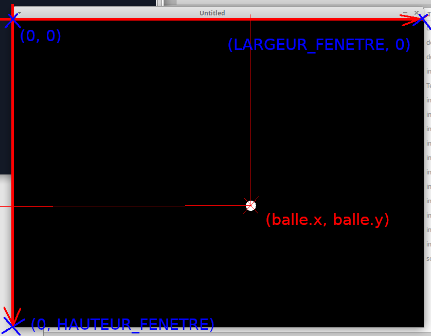
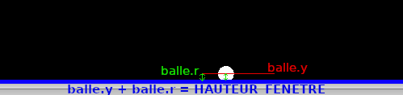
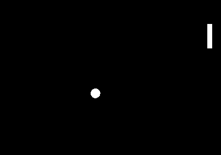
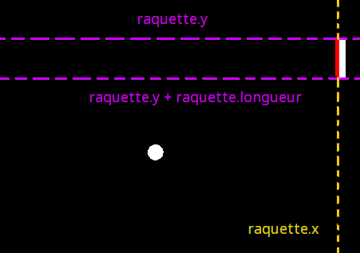
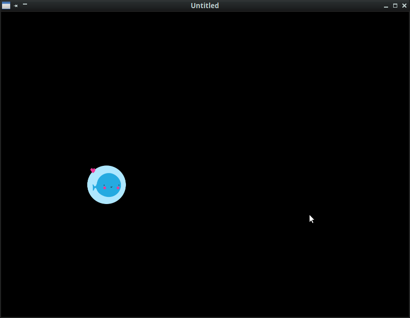
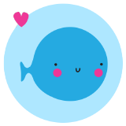
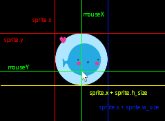

# Atelier 4 : Gérer les collisions

Dans un jeu il est essentiel de pouvoir traiter les contacts entre les différentes entités ou objets représentés à l’écran : personnage bloqué par des obstacles dans ses déplacements, choc entre personnages ou par exemple entre missiles et vaisseaux dans un shoot’em up, contact avec le sol dans un jeu de plate-formes, etc. Ces contacts peuvent être suivi d’effets qui différent en fonction du gameplay : rebond d’une balle, explosion d’un vaisseau, disparition d’un objet qu’on ramasse, recul d’un personnage qui s’est pris un coup, etc. Il y a de nombreuses manière de gérer les collisions en jeu, plus ou moins sophistiquées, plus ou moins gourmandes en calcul. Nous allons en voir quelques unes parmi les plus simples.

## Collision d’une balle avec le bord de l’écran (et rebond)

Si on veut programmer une balle qui avance dans une direction à l’écran, créons d’abord une table qui va nous permettre de stocker toutes les données liées à cette balle (ses « propriétés ») : position x et y, vitesse horizontale et verticale vx et vy, taille de la balle (son rayon r)…

```lua
balle = {}
balle.x = love.graphics.getWidth()/2
balle.y = love.graphics.getHeight()/2
balle.r = 10
balle.vx = 100
balle.vy = 100
```

Les fonctions `love.graphics.getWidth()` et `love.graphics.getHeight()` donnent respectivement la largeur et la hauteur de la fenêtre. 

Pour faire avancer la balle, il suffit de mettre à jour les coordonnées `x` et `y` de la balle en fonction des vitesses `vx` et `vy` dans la fonction `love.update()` (sans oublier le rôle de la variable `dt`)

```lua
function love.update(dt)
 
  balle.x = balle.x + balle.vx*dt
  balle.y = balle.y + balle.vy*dt
 
end
```

Et enfin il suffit de dessiner la balle avec la fonction `love.draw()` :

```lua
function love.draw()

  love.graphics.circle('fill', balle.x, balle.y, balle.r)
   
end
```

Si on lance ce programme, on se rend compte qu’assez rapidement la balle sort de l’écran : en effet elle va toujours dans la même direction. Tu peux d’ailleurs ajouter une ligne dans `love.draw()` pour afficher les coordonnées de la balle, nous avons vu précédemment la fonction qui permet d’afficher du texte dans la fenêtre de jeu.

Pour que la balle reste dans l’écran une méthode est de changer la direction de la balle quand ses coordonnées correspondent au bord de la fenêtre.

Par exemple, si `vy` est la vitesse verticale de la balle, si `vy` est > 0, alors la balle va aller vers le bas.

Donc dès que la coordonnée `y` de la balle est supérieure ou égale à celle du bord inférieur de la fenêtre, il faudrait inverser la vitesse verticale de la balle pour que la balle aille dans la direction opposée (vers le haut), comme pour un rebond. 

Pour connaître la taille (hauteur, largeur) de la fenêtre, on utilise les fonctions `love.graphics.getHeight()` et `love.graphics.getWidth()`. Nous allons souvent les utiliser. Pour faciliter l’écriture et la lisibilité du code, et éviter de les appeler à répétition, il vaut mieux, dès le début du programme, stocker ces valeurs dans des variables qu’on va considérer comme des constantes (on va les écrire en majuscule pour les reconnaître) :

```lua
HAUTEUR_FENETRE = love.graphics.getHeight()
LARGEUR_FENETRE = love.graphics.getWidth()
```

Ensuite il suffit de tester la valeur de `balle.y` pour savoir si elle est supérieure ou égale à la valeur de `HAUTEUR_FENETRE` que l’on vient de calculer, et si cette condition est vraie, d’inverser la valeur de `balle.vy` en la multipliant par -1 :

```lua
function love.update(dt)

  if balle.y >= HAUTEUR_FENETRE then
		balle.vy = -1 * balle.vy
  end
  
  balle.x = balle.x + balle.vx*dt
  balle.y = balle.y + balle.vy*dt
 
end
```

Il est très important pour comprendre cet algorithme de bien avoir à l’esprit le système de coordonnées de la fenêtre de jeu. L’origine, le point de coordonnées (0, 0), est le coin haut gauche de la fenêtre, et l’axe des x va de gauche à droite (x = 0 correspond au bord gauche, et les x augmentent quand on va vers la droite), mais l’axe des y est inversé par rapport à la convention ordinaire : y = 0 correspond au bord du haut, et les y augmentent quand on va vers le bas de la fenêtre.



Pour faire rebondir sur les autres bords de la fenêtre on va procéder exactement de la même manière : inverser `balle.vx` quand la balle atteint le bord droit ou le bord gauche, et inverser `balle.vy` quand la balle atteint le haut de la fenêtre.

Tu as tout ce qu’il faut pour écrire un programme où la balle rebondit sur les 4 bords de l’écran.

Essaye !

Plutôt qu’un rebond, on peut attacher un autre événement à ces situations. Par exemple dans le jeu Pong, alors que la balle rebondit bien sur les bords haut et bas de la fenêtre, ce n’est pas la même chose pour les bords droit ou gauche : dans ces cas la balle disparait, rapporte un point au joueur du bord opposé, et est remise en jeu. Mais du point de vue de la programmation, les conditions testées sont identiques, c’est juste les conséquences (le code exécuté après le `then`) qui sont différentes.

Enfin, si on regarde bien ce qu’il se passe à l’écran, ce n’est pas parfait. La balle rebondit, mais on voit qu’à chaque rebond, il y a au moins la moitié de la balle qui sort de l’écran. C’est parce que l’on teste la position x et y de la balle, qui correspond en fait au centre de la balle : nous avons oublié dans nos tests que la balle a une épaisseur.

Comment doit-on modifier nos tests pour prendre en compte l’épaisseur de la balle ?

Par exemple pour notre test sur le bas de l’écran, il faudrait ajouter le rayon r de la balle à la coordonnée y (regarde la figure ci-dessous pour bien comprendre) :

```lua
if balle.y + balle.r >= HAUTEUR_FENETRE then
		balle.vy = -1 * balle.vy
  end
```



Modifie toutes les conditions de ton programme pour avoir un rebond dès que le bord de la balle touche les bords de la fenêtre. Attention, il y a une différence quand la balle touche les bords gauche et haut, et les bords bas et droite… fait un dessin au préalable pour bien déterminer la condition à tester.

## Collision entre éléments : détecter si une raquette renvoie une balle

Dans la section précédente nous avons étudié la mise en place de collisions dans un contexte passif, l'interaction d'un élément (la balle) avec son environnement (les bords de la fenêtre). Tout ce qui fait l'intérêt d'un jeu est dans l'interaction : voyons comment gérer les collisions d'un élément avec un autre élément qui lui est contrôlé par le joueur. Par exemple une balle qui rebondit sur une raquette (comme dans Pong, les casses-briques, etc.)




Créons donc une raquette "façon Pong" dans notre programme. Il s'agit d'un rectangle définit par la position de son sommet haut-gauche, une épaisseur et une longueur. On peut aussi la doter d'une vitesse de déplacement (seulement verticale, vu que c'est la seule direction où elle peut aller)

```lua
raquette = {}
raquette.x = LARGEUR_FENETRE - 30
raquette.y = HAUTEUR_FENETRE/2
raquette.epaisseur = 10
raquette.longueur = 50
raquette.vy = 75
```

Pour afficher la raquette il suffit d'ajouter dans la fonction `love.draw()`

```lua
love.graphics.rectangle('fill', raquette.x, raquette.y, raquette.epaisseur, raquette.longueur)
```
Et mettenant on veut la faire bouger verticalement lorsque l'on appuie sur les touche "haut" et "bas" du clavier.

Il suffit de rajouter dans la fonction `love.update(dt)` :

```lua
if love.keyboard.isDown('up') then
    raquette.y = raquette.y - raquette.vy*dt
end
if love.keyboard.isDown('down') then
    raquette.y = raquette.y + raquette.vy*dt
end
```

Pourquoi calcule-t-on `raquette.y - raquette.vy*dt` lorsque l'on veut diriger la raquette vers le haut, et `raquette.y + raquette.vy*dt` lorsque l'on veut diriger la raquette vers le bas ?

On constate que tant que l'on appuie sur les touches "haut" et "bas" la raquette monte ou descend jusqu'à sortir de l'écran. Peux-tu modifier ce code, en fonction de ce que l'on a vu dans la section précédente, afin que la raquette reste bloquée à l'intérieur de la fenêtre ?

Ensuite, on aimerait bienque la balle rebondisse sur la raquette.

Le principe est exactement le même que précédemment, ce sont juste les conditions testées qui changent. Dans le cas d'une collision avec le bord de l'écran, il suffit juste de tester si une des coordonnées de la balle dépasse l'une des dimensions de la fenêtre (hauteur pour la coordonnée y, largeur pour la coordonnée x). 

Ici il faut être plus précis : ce n'est pas un bord entier de la fenêtre dont il s'agit, mais d'une petite portion de l'espace délimité par le bord d'une raquette. Deux conditions doivent être testées simultanément : la coordonnée x de la balle est elle "devant" ou "derrière" la position x de la raquette, et la coordonnée y de la balle est elle comprise dans l'intervalle délimité par les bords hauts et bas de la raquette ?

Le schéma suivant indique quelles sont les variables et les valeurs à considérer pour tester les coordonnées de la balle et savoir si elle a touché le bord de la raquette ou non :



Il faut donc remplir trois conditions : 

1. que la coordonnée x de la balle soit supérieur ou égale à la coordonnée x de la raquette
2. que la coordonnée y de la balle soit supérieure ou égale à la coordonnée y de la raquette (bord du haut)
3. que la coordonnée y de la balle soit inférieure ou égale à la coordonnée y de la raquette additionnée de la longueur de la raquette (bord du bas)

Voici le bout de code qui permet de tester la collision entre la balle et la raquette :

```lua
if balle.x >= raquette.x and balle.y >= raquette.y and balle.y <= raquette.y + raquette.longueur then
    balle.vx = -1 * balle.vx
end
```
Et c'est tout ! 3 lignes suffisent pour rendre le jeu jouable...

Par contre on voit que la balle s'enfonce dans la raquette... toujours la même histoire : on a oublié que la balle avait une épaisseur ! Les coordonnées `balle.x` et `balle.y` concenrent le centre de la balle, or on veut que la balle rebondisse dès que le bord de la balle touche la raquette.

Sauras-tu modifier le code pour que cela soit le cas ? N'hésite pas à refaire un schéma en indiquant les différentes variables pour t'aider.

Cela fait, on peut transformer ce programme en jeu :

- faire un compteur de balle, et le jeu s'arrête dès que le compteur est à zéro (*game over*), et afficher le nombre de balle restante sur l'écran de jeu
- faire en sorte que dès que la balle touche le bord droit de la fenêtre, elle soit remise en jeu au centre de l'écran, et que le joueur perde une balle (mettre le compteur à jour)
- créer une variable score, et faire gagner des points à chaque fois que la balle rebondit

On peut aussi imaginer un jeu de Pong semblable à l'original : 2 joueurs, un système de score... arrivé ici tu sais programmer tout cela ! Essaye.

## Tester si on a cliqué sur un sprite

Imaginons un autre contexte de jeu pour les collisions, avec un jeu dont l'objectif est de cliquer sur un sprite qui se déplace à l’écran. Lorsque l’on y arrive, le sprite va accélérer.



Pour l’exercice, on va simplement faire un sprite qui traverse l’écran horizontalement, à une certaine vitesse. À chaque clic gauche sur le sprite, celui-ci accélerera. Essaye de faire ce programme par toi-même ;)

Voici l’image que l’on peut utiliser pour le sprite :



<details>
<summary>Tu peux voir une proposition de solution en déroulant (clique sur le petit triangle à gauche) </summary> 
<br>

1. Tout d’abord on crée une table qui contient toutes les variables qui nous serons utiles : position x et y du sprite, vitesse de déplacement, image, taille de l’image...
  
<details>
<summary style='text-indent:30px'> (Dérouler pour voir le code correspondant)</summary>
<br>

```lua
sprite = {}
sprite.x = 0
sprite.y = W_HEIGHT / 2
sprite.vx = 100
sprite.pix = love.graphics.newImage('love2.png')
sprite.w_size = sprite.pix:getWidth()
sprite.h_size = sprite.pix:getHeight()
```

</details>
<br>

2. Ensuite on crée un `update()` qui fait défiler le sprite à l’écran : on décale sa position `x` de quelques pixels (le nombre de pixel que l’on ajoute est la vitesse horizontale `vx` du sprite) à chaque frame, et quand il arrive au bord de l’écran, on réinitialise sa position à 0.

<details>

<summary style='text-indent:30px'> (Dérouler pour voir le code correspondant) </summary>
<br>

```lua
function love.update(dt)

  sprite.x = sprite.x + sprite.vx * dt
  if sprite.x > W_WIDTH then
    sprite.x = 0
  end

end
```

</details>
<br>

3. On procède au test de collision proprement dit : utiliser la fonction `love.mousepressed()` – ne pas hésiter à réviser [le chapitre précédent sur les contrôles](./atelier) - pour récupérer les coordonnées du pointeur, et voir si on peut en déduire que le pointeur était sur l’image du sprite au moment du clic (voir le schéma ci-dessous). 

    

<details>

<summary style='text-indent:30px'> (Dérouler pour voir le code correspondant) </summary>
<br>

```lua
function love.mousepressed(mouseX, mouseY, button)

  if button == 1 then

    testX = (mouseX > sprite.x) and (mouseX < (sprite.x + sprite.w_size))
    testY = (mouseY > sprite.y) and (mouseY < (sprite.x + sprite.h_size))
    
    if testX and testY then
      sprite.vx = sprite.vx * 2
    end

  end

  sprite.x = sprite.x + sprite.vx * dt
  if sprite.x > W_WIDTH then
    sprite.x = 0
  end

end
```

</details>
<br>

4. Finalement, gèrer l’affichage.

<details>
<summary style='text-indent:30px'> (Dérouler pour voir le code correspondant) </summary>
<br>

```lua
function love.draw()

  love.graphics.draw(sprite.pix, sprite.x, sprite.y, 0, .5, .5) -- On divise par 2 la taille de l’image, qui est de grande taille

end
```
</details>

Et voilà ! Un jeu qui tient en quelques lignes.
Pour l’améliorer, on peut indiquer un système de score : par exemple afficher à l’écran le nombre de fois où le sprite a été touché, et la vitesse atteinte. Avec tout ce que tu as vu jusqu’ici, tu devrais pour voir écrire le code correspondant facilement.

</details>
<br>


## Technique des « bounding boxes »

## Technique des « hot spots »

[Atelier 5 : Sons](./atelier5.md)
md
