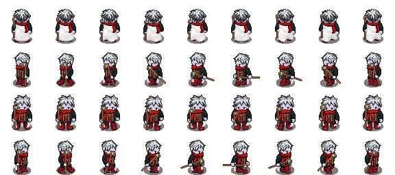
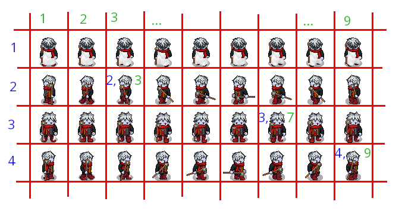
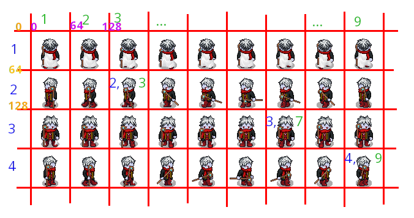

# Atelier 6 : Animation des sprites
Pour le moment, les sprites que nous avons affichés étaient constitués d'une image fixe. Pour rendre ça un peu plus vivant, voyons comment animer nos sprites.

Le principe est exactement le même qu'en animation : nous allons afficher rapidement une succession d'images fixes qui vont donner l'illusion du mouvement. Ces images fixes consisteront simplement une décomposition du mouvemnet que l'on veut rendre à l'écran.

Par exemple pour un personnage qui marche vers la droite la succession d'images :


va rendre l'animation suivante :


(Ces images ont été générées par un ami pour un jeu que je prépare, grâce au site ...)
 
Vu que nous savons afficher des images, nous savons donc afficher une animation, il suffit de trouver comment organiser son code et gérer le bon rythme d'affichage.

Malheureusement si cette méthode d'affichage "image par image" est la plus intuitive et facile à comprendre, elle est un peu lourde à programmer et ce n'est pas non plus la plus efficace.

Nous verrons une seconde méthode, plus optimisée, c'est à dire qui économise plus les ressources disponibles, qui emploie ce que l'on appelle les *spritesheets*. Mais commençons par la méthode image par image, ce qui nous permettra de mieux comprendre et expliquer l'avantage des *spritesheets*.

## Animation image par image

L'animation ci-dessus nécessite de :
- charger les 9 images de l'animation
- définir la cadence de l'animation
- créer une fonction `animate()` qui retournera quelle image il faut afficher
- affichage dans `love.draw()`

Partons d'un squelette de programme `main.lua` que nous connaissons bien maintenant :

```lua

WIDTH = love.graphics.getWidth()
HEIGHT = love.graphics.getHeight()

player = {}
player.x = WIDTH / 2
player.y = HEIGHT / 2

function love.update(dt)
end


function love.draw()
end


function love.keypressed(key)
    
    if key == 'escape' then
        love.event.quit()
    end

end
```

C'est un atelier sur l'affichage : nous allons manipuler beaucoup d'images, il faut donc avoir bien assimilé comment on affiche des images. Nous allons aussi utiliser la variable deltatime `dt` liée au rythme d'affichage. Pour se rafraîchir la mémoire, ne pas hésiter à relire la fin de [l'atelier 1](./atelier1.md) et [l'atelier 2 ](./atelier2.md), notamment la partie sur le deltatime.

### Charger les images

Nous avons 9 images à charger avant de pouvoir les afficher. Comme c'est quelque chose de répétitif on peut faire ça à l'aide d'une boucle. Nous connaissons à l'avance le nombre d'image à charger, donc le nombre de boucle à faire : nous allons donc utiliser une boucle `for`.

Pour que cela fonctionne, il faut que le nom donné aux images obéisse à un *pattern*, un schéma régulier. Ici nous avons choisi :
```
Mage_droite_1.png
Mage_droite_2.png
Mage_droite_3.png
[...]
Mage_droite_9.png
```
On voit que la seule chose qui change est le numéro de l'image. Cela nous permet d'utiliser simplement une boucle `for` pour le chargement (à insérer dans la première partie du code, avant `love.update()`). Par contre, il faut bien charger ces images dans des variables. Le plus simple est de les stocker dans une table, où on va charger les images les unes à la suite des autres, on pourra les retrouver grâce à leur index. Et comme il s'agit de l'animation du personnage joueur, cette table sera en fait une sous-table de celle qui contient les infos du joueur :

```lua
player.framesDroite = {}
```
Si tu ne comprends pas bien cette partie, n'hésite pas à demander à un animateur de l'atelier de t'expliquer. Dès que l'on veut faire des choses un peu sophistiqué pour programmer un jeu nous allons utiliser des tables et des sous-tables, il faut donc bien comprendre et être à l'aise avec ces concepts et cette manière d'organiser les données.

Enfin, comme on veut que notre code soit adapté à n'importe quelle séquence d'image, on va créer une variable pour indiquer le nombre total d'image dont on a besoin, comme ça si on change de séquence on pourra adpater le code très facilement.
Note : on appelle *frame* une image d'une séquence - en français le terme technique cinématographique est "vue".

```lua
player.maxFrame = 9

-- chargement des images pour l'animation du personnage joueur
for n = 1, player.maxFrame do
    player.framesDroite[n] = player.love.graphics.newImage('pix_atelier6/Mage_droite_'..n..'.png')
end
```

Si on lance le programme, on a un écran noir, c'est normal. Sinon corriger les erreurs de syntaxe. Conseil : dès que l'on rajoute quelque chose auc code, même si ce n'est pas sensé avoir d'effet visible, lancer tout de même pour tester qu'au moins ça ne fait pas planter le programme. Mieux vaut le faire régulièrement et corriger au fur et à mesure qu'avoir trop d'erreurs de syntaxe à corriger d'un coup pour s'y retrouver...

### La fonction `animate()`

Intuitivement, maintenant que nous avons chargé les images, on peut se dire qu'il suffit de les afficher à l'aide d'une autre boucle dans la fonction `love.draw()`
On affiche successivement les images 1 à 9, puis - vu que l'on veut une boucle qui se répète, une fois que l'on est arrivé à l'image 9, on revient à la première image :

```lua
function love.draw()

    for n = 1, player.maxFrame do
        if n > maxFrame then
            n = 1
        end
        love.graphics.draw(player.framesDroite[n], player.x, player.y)
    end

end
```

Que se passe-t-il ? Pourquoi cela ne fonctionne pas ?

Cette méthode n'est pas bonne. D'abord, la fonction `love.draw()` affiche les image à un rythme très rapide (qui dépend de la puissance de la machine), ce qui fait qu'on n'a pas le temps de voir l'animation. Ensuite, la fonction `love.draw()` devrait se contenter d'afficher l'image active ou courante du sprite, et c'est tout. En matière d'organisation du code, il vaut mieux calculer quelle image afficher avant d'appeler la fonction `love.draw()`, dans la fonction `love.update(dt)`, ou mieux, dans une fonction dédiée. 

Nous allons donc créer une fonction `Animate()` qui va retourner le numéro de la frame (l'image) qu'il faut afficher à un moment donné, à une certaine cadence : il faut en effet "ralentir" l'affichage, sinon l'animation va aller trop vite. Par exemple l'animation donné en exemple en début de cours se déroule à un rythme d'une image toute les 100ms. On peut donc viser un rythme d'afficher une image tous les 1/10<sup>e</sup> de seconde.

Pour cela il faut :

- initialiser un compteur de temps ("timer") au rythme que l'on souhaite (p. ex. 1/10)
- à chaque rafraîchissement on va retirer l'intervalle de temps écoulé entre chaque rafraîchissement à ce compteur (c'est la valeur du deltatime `dt`)
- quand le compteur atteint 0, c'est qu'il est temps d'afficher l'image suivante dans la séquence, et surtout, de ne pas oublier de réinitialiser le compteur au rythme souhaité.
- une fois qu'on est arrivé à la dernière image, on revient à la première.

C'est l'occasion de découvrir une nouvelle possibilité de lua : on peut attacher une fonction à une table.
Par exemple, on peut très bien attacher notre fonction `animate()` à la table `player` : on sait que cette fonction est sensée agir sur notre personnage joueur.

Ce n'est pas une obligation (surtout si on utilise cette fonction pour d'autre éléments que le joueur : c'est à nous de juger).

Cela se présente comme ça :

```lua
-- on initialise le timer et le numéro de l'image à afficher pour le personnage joueur
player.animTimer = 1/10
player.activeFrame = 1

-- on crée la fonction qui va mettre à jour le numéro d'image à afficher et le compteur
function player.Animate(dt)

    player.animTimer = player.animTimer - dt
    
    if player.animTimer <= 0 then
        player.animTimer = 1/10
        
        if player.activeFrame < 9 then
            player.activeFrame = player.activeFrame + 1
        else
            player.activeFrame = 1
        end
    
    end 

end


love.update(dt)

    -- on appelle la fonction qui met à jour le compteur et l'image à afficher
    player.Animate(dt)

end


love.draw()

    -- on affiche l'image dont le numéro a été mis à jour par la fonction player.Animate()
    love.graphics.draw(player.framesDroite[player.activeFrame], player.x, player.y)

end
```
On constate que notre fonction `love.draw()` est beaucoup plus simple !

Expérimente :
- modifie la valeur d'initialisation de `player.animTimer` pour voir ce que ça fait (pour te simplifier la vie tu peux créer une constante `INIT_TIMER` au début du programme) 
- que se passe-t-il si on ne réinitialise pas la variable `player.animTimer` dans la boucle de la fonction `player.Animate()` ?

### Un peu d'interactivité...

Normalement une animation est déclenchée par un événement en jeu : déplacement, action, blessure, etc.

Là nous avons une animation de marche vers la droite, qui donc ne devrait être déclenchée que lorsque l'on se déplace vers la droite, par exemple en appuyant sur la flèche droite.

Pour cela, il suffit de modifier la fonction `love.update()` de la manière suivante :

```lua
love.update(dt)

    if love.keyboard.isDown('right') then
        player.Animate(dt)
    end

end
```

Voilà, c'est tout ! On voit l'intérêt d'avoir créé une fonction qui ne s'occupe que de l'animation du personnage.

Le résultat n'est pas parfait :
- ce serait bien que le personnage reviennent à la première image (position de repos) quand on cesse d'appuyer sur la flêche droite et pas suspendu dans son mouvement
- on aimerait que le personnage se déplace vraiment vers la droite quand on appuie sur la flèche droite
- ce serait bien qu'il s'arrête quand il atteint le bord de l'écran

Tu dois être capable d'apporter ces améliorations si tu as bien compris les ateliers [contrôles](./atelier3.md) et [collisions](./atelier4.md).

Enfin on voudrait faire en sorte que le personnage se déplace dans toutes les directions, avec une animation adaptée à chaque fois. Si tu en as le courage, tu peux essayer de le faire : toutes les images nécessaires sont disponibles sur le dépôt git de l'atelier (dans le dossier pix_atelier6).
Néanmoins cela fait beaucoup d'images à traiter, et demande aussi d'adapter la fonction d'animation en conséquence... Donc tu peux le faire pour t'entraîner, mais je propose de passer à une méthode plus élaborée, moins facile à comprendre, mais plus facile à programmer pour faire face à ces différentes situations.

## Animation avec les *spritesheets*

C'est une méthode assez simple, mais qui est un peu compliqué à expliquer.

Tout d'abord, qu'est-ce qu'une *spritesheet* ?
C'est une image unique qui contient toutes les séquences d'animation. Par exemple, pour les déplacements de notre personnage :



Le principe est le suivant. Avec la méthode précédente, nous sommes obligé de charger les images qui composent le mouvement une par une. Si on décompose le mouvement en 9 images, et qu'il y a 4 directions de déplacement, cela fait en tout 36 images à charger en mémoire, qui chacune vont occuper un emplacement différent, avec sa propre adresse etc. Il faut en outre que dans notre programme on trouve un moyen de désigner chaque image individuellement pour les manipuler, etc.

Avec la méthode des *spritesheets*, on charge une seule image une fois pour toute en mémoire. Ensuite, le principe ne change pas : on va afficher une séquence d'images qui composent un mouvement, seulement ces séquences seront tirées de l'image unique, en la découpant en sous-parties, grâce à une fonction qui génére un *quad*, qui va nous permettre de masquer les éléments de la *spritesheet* que ne nous intéressent pas.

Pour faciliter le travail de programmation, la *spritesheet* est organisée d'une certaine manière : chaque ligne correspond à une animation en particulier. Ici par exemple la 1<sup>ère</sup> ligne correspond à la marche du personnage vers le haut, décomposée en 9 images. La 2<sup>e</sup> ligne à la marche vers la gauche, etc.

On réalisera donc l'animation que l'on désire en sélectionnant séquentiellement les bouts d'images qui composent la ligne dont on a besoin. Il faut voir la *spritesheet* comme un tableau, dont on peut extraire une image selon le numéro de ligne (en bleu dans l'image suivante) et de colonne (en vert) de cette image :



Nous allons donc modifier notre programme de la manière suivante :

- charger la *spritesheet*
- créer un nouveau *quad* qui nous permettra de sélectionner la partie de la *spritesheet* qui nous intéresse pour mettre à jour l'image affichée (*frame*) pour  l'animation en cours
- modifier la fonction player.Animate() pour qu'elle affiche le bon type d'animation (qui correspond à une ligne donnée de la *spritesheet*) dont nous avons besoin

Une dernière explication théorique. Pour nous, ce qui nous intéresse dans une *spritesheet* c'est de retrouver des images en fonction de la ligne (type d'animation), et de la colonne (image donnée d'une séquence d'animation) auxquelles elles appartiennent.

Mais le programme ne peut par exemple pas directement prendre l'image de la 3<sup>e</sup> ligne et 4<sup>e</sup> colonne de la *spritesheet* : la *spritesheet* est une image, et les seuls éléments qu'elle contient sont des pixels ! C'est à nous de fournir au programme les informations qui lui permettront de faire la conversion entre les lignes/colonnes que nous désiront et les pixels qui correspondent à la bonne image sur la *spritesheet*.

Par simplicité, chaque image (ou *frame*) de notre animation a la même taille. Ici ce sont des carrés de 64 pixels de côté (cela peut varier en fonction des *spritesheets*, des jeux, de nos besoins...). La première ligne est donc constituée de toutes les images qui s'étendent entre les pixels de coordonnées y comprises entre 0 et 64. 

Plus précisément ,la première image de la première ligne correspond donc à un carré de 64 pixels de côté dont le sommet haut-gauche a les coordonnées (0, 0). 



On voit sur le dessin ci-dessus que l'image de la 2e ligne et 3e colonne fait aussi 64 pixel de côté, mais à partir du sommet haut-gauche dont les coordonnées sont (64, 128). Pour retrouver ces coordonnées on fait pour x : (numéro de colonne - 1) X largeur de la *frame*, et pour y : (numéro de ligne - 1) X longueur de la *frame*. Ici, respectivement (3-1)X64 = 128 et (2-1) X 64 = 64.

Pourquoi s'intéresse-t-on au sommet haut-gauche ? Parce que c'est le système de coordonnées classque dans les jeux vidéos ! Nous l'avons déjà vu. Et que c'est également à partir du sommet haut-gauche d'une *frame* que les *quads* permettent de les isoler.

Avec ceci bien en tête (n'hésite pas à faire appel à un animateur si tu ne comprends pas tout, etc.), voyons comment on procède en pratique.

### Charger la *spritesheet* et les *quads*

Pas de problème pour charger la spritesheet :

```lua
player.spritesheet = love.graphics.newImage('pix_atelier6/Mage_walking.png')
```
Ensuite nous avons vu que nous allons faire des calculs à partir de la taille du sprite du personnage, ça peut être intéressant de stocker cette valeur que l'on va utiliser souvent, de même que créer des variables où l'on va stocker les coordonnées en ligne/colonne de la *frame* courante (qu'on va afficher) :

```lua
player.size = 64 -- taille de la frame 
player.col_sheet = 1 -- colonne de la première frame de la séquence
player.line_sheet = 3 -- colonne de la premmière frame de la séquence (personnage de face)
```

Enfin la fonction qui nous permet de charger un *quad* est la fonction : `love.graphics.newQuad()` (qui l'eût cru ?)

Cette fonction va agir comme un masque qui va isoler le *frame* qui nous intéresse sur la *spritesheet*. Pour cela il lui faut comme informations (paramètres) :
 - les coordonnées (en pixel, coin bas-gauche) de la première image de la séquence d'animation
 - la taille (largeur et longeur) des *frames*
 - les dimensions de la *spritesheet*, idem, largeur et longueur

Voilà à quoi ça ressemble :

```lua
player.sprite = love.graphics.newQuad(
    (player.col_sheet - 1) * player.size, -- calcul vu plus haut pour les coord. x de la frame
    (player.line_sheet -1 ) * player.size, -- calcul vu plus haut pour les coord. y de la frame
    player.size, -- largeur du sprite/frame
    player.size, -- longueur du sprite/frame
    player.spritesheet:getDimension() -- permet d'obtenir directement les dimension de l'image (spritesheet)
)
```

### Nouvelle fonction `player.Animate()`

À part changer quelques noms de variables, nous allons très peu modifier la fonction `player.Animate()`. Le principe reste le même : pour une direction donnée nous allons simplement afficher successivement toutes les *frames* d'une ligne, puis re-boucler sur la première *frame* si le mouvement se poursuit.
La variable qui indique quelle frame afficher n'est plus `player.activeframe` (qui correspondait à une image isolée) mais `player.col_sheet` (qui, associé à `player.line_sheet` correspond à une frame dans la *spritesheet*).

En incrémentant la variable `player.col_sheet`, on veut décaler le masque (le *quad*) qui permet d'isoler la bonne *frame* sur la *spritesheet*. Il faut donc une fois qu'on a les coordonnées de la *frame*, mettre à jour ce masque. Cela se fait avec la méthode `:setViewport()` (une méthode est une espèce de fonction), qui prend en paramètre la nouvelle coordonnée de la *frame* désirée (coordonnées du sommet haut-gauche et dimensions de la frame). Le code sera certainement plus parlant :

```lua
function player.Animate(dt)

    player.animTimer = player.animTimer - dt
    if player.animTimer <= 0 then
        player.animTimer = 1/10
        if player.col_sheet < 9 then
            player.col_sheet = player.col_sheet + 1
        else
            player.col_sheet = 1
        end
    end
 
    player.sprite:setViewport(
        (player.col_sheet - 1) * player.size,
        (player.line_sheet - 1) * player.size,
        player.size,
        player.size)

end
```

### Interactivité et affichage

Enfin il ne reste plus qu'à faire deux choses :
- sélectionner la bonne ligne de la *spritesheet* en fonction de l'animation voulue
- afficher l'animation

Pour le premier point, il suffit de mettre à jour la variable `player.line_sheet` : lorsque l'on va vers la droite c'est la ligne 4 de la *spritesheet* qu'il faut afficher

```lua
function love.update(dt)

    if love.keyboard.isDown('right') then
        player.line_sheet = 4
        player.Animate(dt)
    end

end
```

Enfin il ne reste plus qu'à afficher la *frame* isolée par le *quad*, il y a une petite subtilité ici. On va demander à `love.graphics.draw()̀` d'afficher la *spritesheet*, mais on va aussi lui fournir le *quad* en paramètre, et elle va automatiquement isoler le *frame* qui correspond au *quad* mis à jour dans notre fonction `player.Animate()` :

```lua
function love.draw()

    love.graphics.draw(player.spritesheet, player.sprite, player.x, player.y)

end
```

Et voilà ! Quand on appuie sur la flèche droite, on a l'animation d'un personnage qui marche vers la droite.

## Défis

Termine ce programme :

- fait en sorte que la bonne animation soit jouée quand on appuie sur les flèches de chaque direction
- fait en sorte que le personnage avance réellement à l'écran
- fait en sorte qu'il s'arrête dès qu'il a atteint le bord de l'écran.

[Atelier 7 : TileMap](./atelier7.md)
