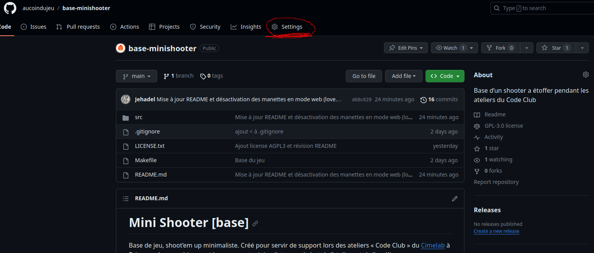
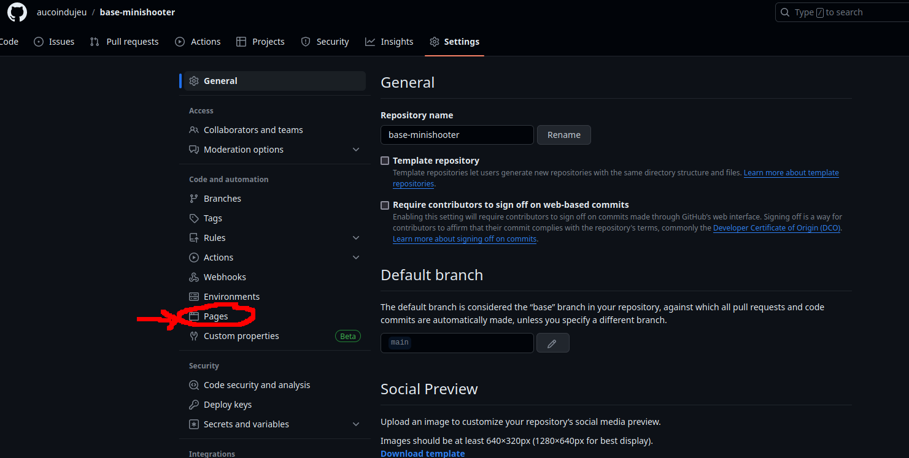
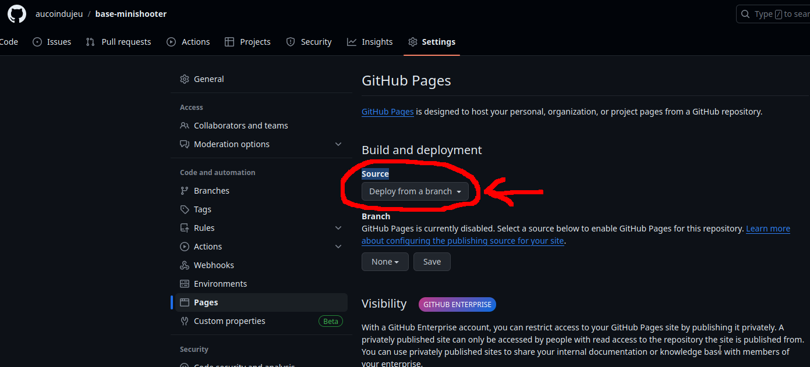
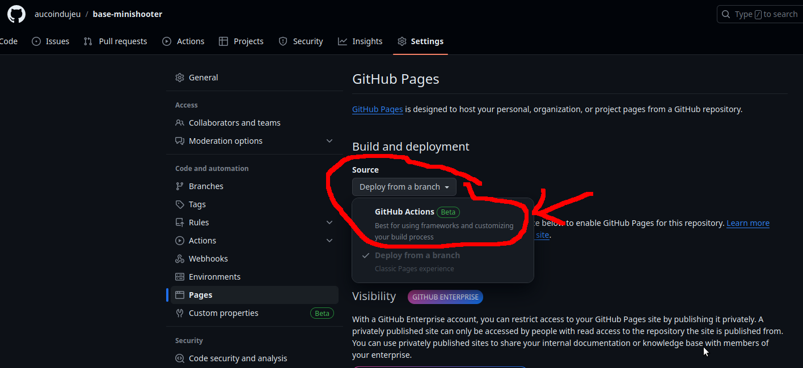
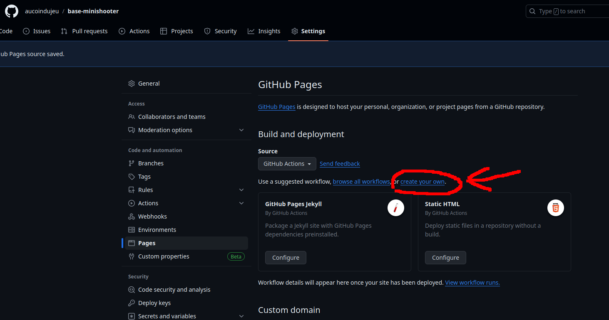
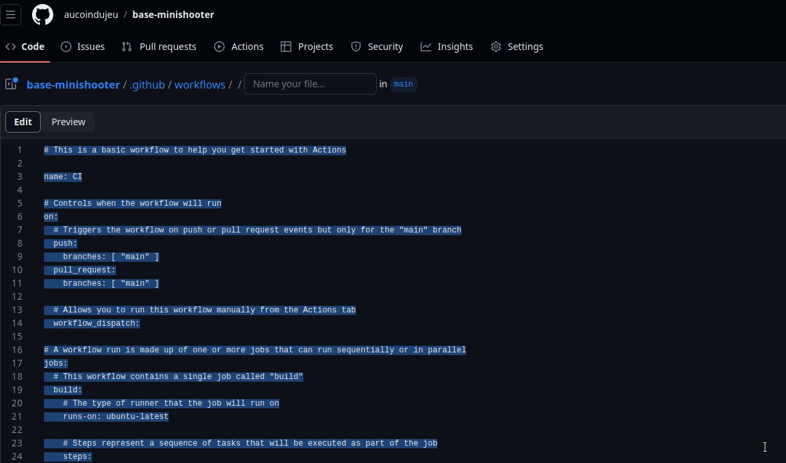
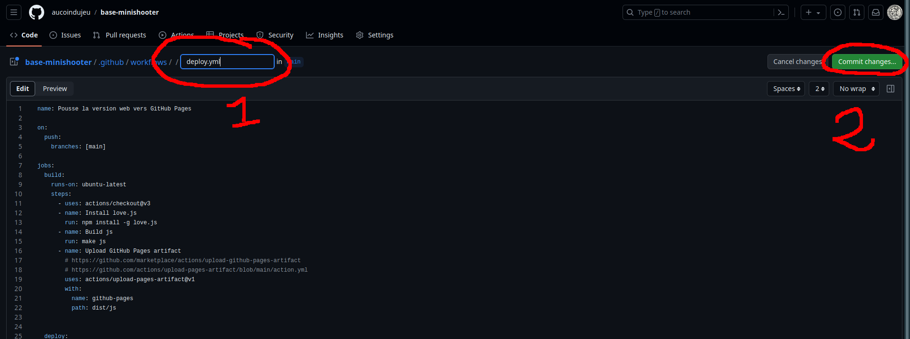

# Distribuer ses jeux

Faire des jeux, c’est bien, les faire jouer, c’est mieux !
Pour distribuer ses jeux, on peut très bien demander aux gens de cloner le dépôt du jeu, d’installer LÖVE2D et d’exécuter notre code… mais on peut leur simplifier la vie. Soit leur permettre de télécharger le jeu en un fichier téléchargeable, voire de jouer en ligne (avec certaines limitations).

## Distribuer un fichier unique

### Fichier `.love`

Les jeux créés sous LÖVE2D sont généralement distribués sous la forme d’un fichier unique au format `.love`. En fait il s’agit juste d’une archive `zip` dont ont a changé l’extension.
Pour cela :

1. Allez dans le répertoire qui contient le code source de votre jeu

2. Sélection *tous* les fichiers 

3. Après un clic droit sélectionnez `ajouter à l’archive…` dans le menu déroulant qui apparait pour générer une archive `zip` avec le logiciel de compression installé sur votre système

4. Renommer l’archive générée avec une extension `.love`

C’est aussi simple que ça.

Avec Linux vous pouvez faire cela simplement en ligne de commande :

```bash 
$ cd <le_dossier_contenant_votre_code>
$ zip -r ../<nom_du_jeu>.love
```

Le fichier `.love` sera généré dans le répertoire parent de celui contenant votre code. Par contre pour être lancé, votre jeu aura toujours besoin que LÖVE2D soit installé, ce qui n’est pas très pratique lorsque l’on veut distribuer son jeu.

### Générer un exécutable `.exe` (Windows)

Lancer un fichier `.love` demande d’avoir LÖVE2D installé sur la machine où l’on désire jouer. Nous allon donc créé un fichier indépendant qui peut s’exécuter en toute autnomie. Pour cela, il va falloir inclure dans notre archives tous les fichiers qui permettent à LÖVE2D de se lancer : le fichier `love.ex` et les `.dll` associées. 

Le plus simple, pour une distribution Windows : 
1. téléchargez sur le site de LÖVE2D la version portable de LÖVE2D (l’archive au format zip qui contient love.exe et les `.dll`)

2. décompressez et ouvrez ce dossier et copier le `.exe` et les `.dll` dans le répertoire où vous avez créé votre fichier `.love` (voir section précédente)

3. ouvrez une invite de commande dans le répertoire où se trouve vos fichiers `.love`, `.exe` et les `.dll` (clic droit et sélectionner `Ouvrir dans le terminal`)

4. entrer la commande :

```PowerShell
copy \b love.exe+<nom_de_votre_fichier>.love <nom_de_votre_jeu>.exe
```

Note : si vous désirez générer un exécutable Windows depuis une machine sous Linux, la commande est :

```bash
cat love.exe <votre_jeu>.love > <votre_jeu>.exe
```

5. créez, si vous le désirer, une archive pour la distribution à partir du répertoire contenant votre nouveau fichier `.exe` et les `.dll`.

Dans tous les cas il n’est pas inutile de préciser dans un fichier `conf.lua` pour quelle version de l’interpréteur le jeu a été écrit :

```lua
function love.conf(t)
    t.version = "<numéro_de_version>"
end

```

### Générer un exécutable (Linux)

Il n‘y a pas de moyen simple de générer un exécutable d’un jeu. LÖVE2D faisant parti des paquet installables depuis un dépôt Debian, il est assez facile de l’installer et d’exécuter des fichiers `.love`.

Sur le wiki de love2d.org on peut trouver des [instructions](https://love2d.org/wiki/Game_Distribution#Distribution_for_Linux) pour créer une AppImage de son jeu, qui contient également l’interpréteur.

## Proposer son jeu en ligne avec GitHub

[Love.js](https://github.com/Davidobot/love.js) va utiliser [empscripten](https://emscripten.org/) pour compiler à partir de votre fichier `.love` du code exécutable très rapidement par les navigateurs web (du WebAssembly), et donc pouvant être mis en ligne.

Par exemple vous pourrez mettre une version de démonstration du jeu à côté de votre dépôt sur GitHub (comme nous l’avons fait pour les projets de base de cet atelier, par exemple [base-bubleboble](https://aucoindujeu.github.io/base-bubblebobble/) ou [base-asteroidsrace](https://aucoindujeu.github.io/base-asteroidsrace)).

### Préparer son code

L’utilisation de ```love.js``` se fait au prix d’une limitation : impossible d’utiliser des manettes de jeu *(gamepads, joysticks)* en ligne. Il faut donc ajouter les lignes de codes suivantes pour désactiver les manettes si l’exécution se fait en ligne :

```lua
-- Are we in love.js? Joysticks are not supported there.
-- https://github.com/Davidobot/love.js/issues/74
if love.system.getOS() == "web" then
    -- Joysticks don't work in love.js
    -- https://github.com/Davidobot/love.js/issues/41
    t.modules.joystick = false
end
```

### Configurer une `GitHub Page`

On peut configurer une page web où s’exécutera notre programme. Par défaut son adresse sera de la forme `https://<nom_utilisateur>.github.io/<nom_du_dépôt>`, ainsi, par exemple : [https://aucoindujeu.github.io/base-minishooter/](https://aucoindujeu.github.io/base-minishooter/)


Pour ce faire :

1. Aller sur la page de votre dépôt et cliquer sur `settings` :



2. Sélectionner la section `pages` dans la liste à gauche :



3. Cliquer sur le menu déroulant intitulé `Sources` :



4. Sélectionner, dans ce menu déroulant, `GitHub Actions` :



5. Cliquer, sur la ligne qui vient d’apparaître, sur `Create your own` :



6. Sélectionner tout le code qui vient d’apparaître, tout effacer :




et le remplacer par le code ci-dessous (merci [Régis](https://github.com/regisb)) :

```yaml
name: Pousse la version web vers GitHub Pages

on:
  push:
    branches: [main]

jobs:
  build:
    runs-on: ubuntu-latest
    steps:
      - uses: actions/checkout@v3
      - name: Install love.js
        run: npm install -g love.js
      - name: Build js
        run: make js
      - name: Upload GitHub Pages artifact
        # https://github.com/marketplace/actions/upload-github-pages-artifact
        # https://github.com/actions/upload-pages-artifact/blob/main/action.yml
        uses: actions/upload-pages-artifact@v1
        with:
          name: github-pages
          path: dist/js


  deploy:
    runs-on: ubuntu-latest
    needs: build
    permissions:
      pages: write      # to deploy to Pages
      id-token: write   # to verify the deployment originates from an appropriate source
    environment:
      name: github-pages
      url: ${{ steps.deployment.outputs.page_url }}

    steps:
      - name: Deploy to GitHub Pages
        # https://github.com/marketplace/actions/deploy-github-pages-site
        id: deployment
        uses: actions/deploy-pages@v2
        with:
          artifact_name: github-pages
```

7. Nommer, dans le champ vide au-dessus du code, le fichier `deploy.yml` (1) et ensuite cliquer sur `Commit change…` (bouton ver à gauche) (2) :



Voilà ! Votre jeu devrais être accessible sur la page `https://<nom_compte_github>.github.io/<nom_de_votre_dépôt>`

En cas de besoin, voilà la [page d’aide pour les GitHub Pages](https://docs.github.com/fr/pages/getting-started-with-github-pages/configuring-a-publishing-source-for-your-github-pages-site)

<!---
### Installer `node.js`

`love.js` utilise `node.js`, il faut donc installerl ce dernier.

1.

### Installer  `love.js`
-->