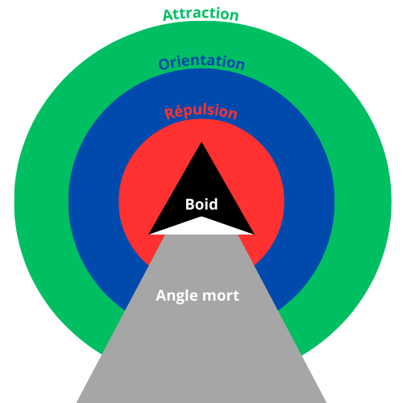
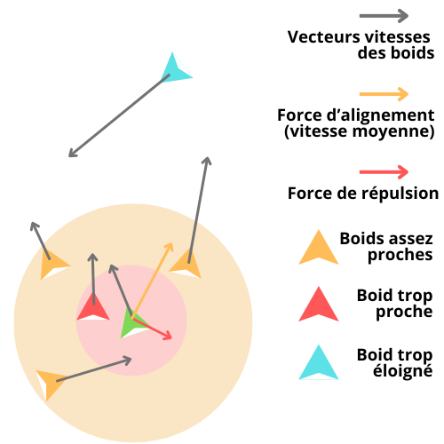
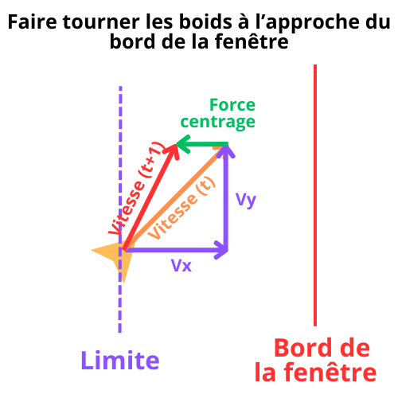
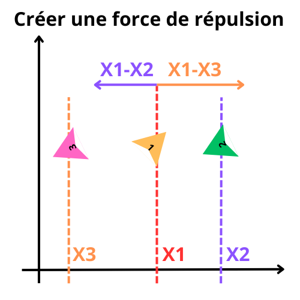
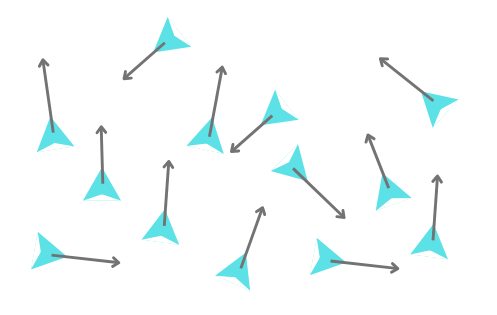
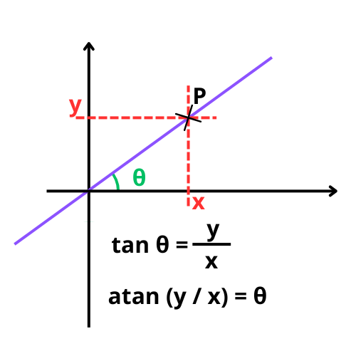
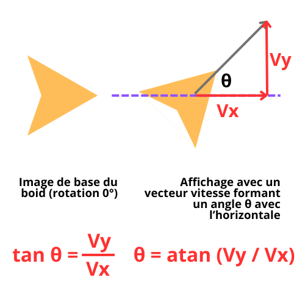
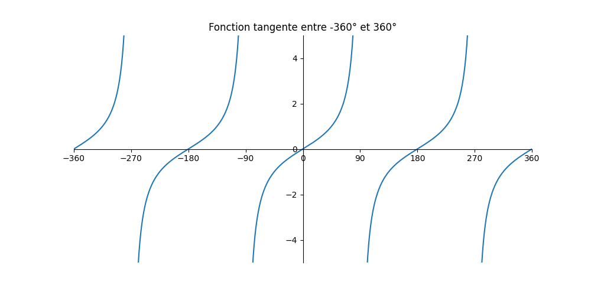
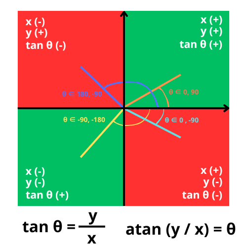

[TOC]


# Atelier : les boids

## Présentation

Vous avez sûrement déjà été captivé par les vols d’étourneaux à l’automne ?

Par exemple comme sur cette [vidéo](https://vimeo.com/58291553).

L’étourneau est une espèce d’oiseaux très sociable (il peuvent former des groupements de centaines de milliers voir de millions d’individus). En été on peut la retrouver jusqu’en Scandinavie ou en Russie, mais avec l’arrivée de l’automne, elle se rassemble dans des régions plus tempérées. C’est alors qu’on peut observer ces fameuses nuées (*starlings swarm* ou *murmurations* en anglais).

	 https://pixabay.com/fr/photos/des-oiseaux-%C3%A9tourneaux-sauvage-bleu-658586/

Cet atelier vous propose d’explorer un algorithme inspiré par ce phénomène et très utilisé pour le *flocking* (de *flock* : troupeau, foule), c’est à dire la programmation du déplacement en nuées ou foules de sprites. Il appartient au domaine de l’IA dans les jeux vidéos dans le sens où il régie le comportement d’agents autonomes. C’est comme le jeu de la vie un exemple de comportement auto-organisé, ou émergent : un comportement global complexe est obtenu par des règles individuelles très simples. C’est l’interaction entre les individus qui amène de la complexité. C’est par ailleurs un algorithme très utilisé dans l’animation.

Il a été créé par [Craig W. Reynolds](https://en.wikipedia.org/wiki/Craig_Reynolds_(computer_graphics)), un infographiste qui à l’époque travaillait pour Disney, par exemple sur le film [Tron](https://www.imdb.com/title/tt0084827/)) et qui s’est aussi intéressé à la [vie artificielle](https://fr.wikipedia.org/wiki/Vie_artificielle). Il a proposé en 1986 une simulation de vols en nuées d’oiseaux qui a fait la sensation à la [SIGGRAPH](https://s2024.siggraph.org/) (une prestigieuse convention de l’industrie de l’image numérique) l’année suivante. Il a surnommé les agents qui se déplaçaient ainsi des boids (*bird - oids*).

Voici une démo très simple que j’ai réalisée : https://jehadel.github.io/love-boids/

L’objectif de cet atelier est de reproduire une démo similaire, et même plus complète et rigoureuse, et ensuite de l’enrichir avec d’autres comportements, et en ajoutant de l’interactivité.

## Principes

Alors qu’on pourrait croire que contrôler le mouvement de milliers d’agents est compliqué, il suffit de fixer trois règles très simples auxquelles vont obéir chacun des agents individuellement : 

- **séparation** : deux boids ne peuvent pas être au même endroit au même moment
- **cohésion** : les boids vont avoir tendance à se rapprocher pour former un groupe
- **alignement** : les boids volent dans la même direction et à la même vitesse pour rester groupé

De ces trois règles vont *émerger* ces déplacements en nuées très fluides.

Pour programmer ces règles, on définit pour chaque boid différentes zones (la forme la plus simple sont des cercles centrées sur le boid et de rayons différents). La présence ou non d’un autre boid dans ces zones va déclencher des comportements associés :

- une zone de répulsion (la plus proche du boid) : si un autre boid est dans cette zone, le boid va s’en éloigner
- une zone d’attraction (la plus éloignée du boid) : si un autre boid est dans cette zone, le boid va s’en rapprocher
- une zone d’orientation (intermédiaire, mais elle peut se  confondre aussi avec la zone d’attraction) : si un autre boid est dans cette zone, le boid va le suivre, en alignant sa direction et sa vitesse)
- le boid sera indifférent à tout ce qui est au delà de la zone d’attraction. On peut aussi définir un angle mort derrière le boid qui le rendra également insensible à tout ce qui se trouve dans cet angle.



On peut conceptualiser le problème également en imaginant que chaque boid se déplace dans une direction et à une vitesse donnée, et 3 forces de nature différente vont s’appliquer à chaque boid : répulsion, attraction ou cohésion que l’on va pondérer avec différents paramètres

- Un boid va être attiré par le barycentre de la position des boids qu’il « voit » (force d’attraction ou de cohésion )
- Un boid va ajuster sa vitesse à la moyenne des vitesses des boids autour de lui (force d’alignement)
- Un boid va garder ses distances avec les boids qui sont « trop proches » (force de répulsion)

Pour simplifier, on  va représenter dans le schéma suivant les deux dernières  forces (et qui en fait sont suffisantes pour obtenir un résultat satisfaisant). En ne considérant donc que les forces de répulsion et d’alignement, voici les vitesses et les forces qui s’appliquent à un boid donné (il faut imaginer la même chose pour tous les autres boids) :




Les boids trop éloignés (ou dans l’angle mort) n’auront aucune influence.

Les boids dans la zone « d’orientation » (ou de cohésion) vu par le boid considéré exerceront une force proportionnelle à la moyenne de leurs vecteurs vitesses.

Les boids dans la zone « de répulsion » exerceront une force de répulsion.

La nouvelle vitesse du boid sera égale à son ancienne vitesse modifiée par ces forces (changement de direction, d’intensité).

## Code

On code tout ça ?

Comment on va s‘y prendre :

* on va d’abord créer une classe ``` Boid()```. Cette classe va faire peut de choses pour le moment : stocker les attributs des boids (position x, y et vitesse avec les deux composantes Vx, Vy), updater la position du boid (en ajoutant vx à x et vy à y) pour le faire avancer, afficher le boid, orienter le boid dans la direction selon laquelle il avance 
* on va ensuite dans un premier temps modifier la méthode qui update la position du boid en intégrant une  force qui maintien le boid  au sein de la fenêtre (centrage/centering), cette force va modifier la vitesse du boid, on aura donc aussi une méthode qui update la vitesse des boids
* on veut un essaim de boids : on va créer une liste de boids et tous les afficher et updater leur position
* l’étape suivante consistera à les faire interagir : on va créer un rayon de vision et une zone de répulsion propre à chaque boid, et une méthode qui calcule la force de répulsion qui s’applique à chaque boid. Cette méthode, comme les suivantes, aura besoin de la liste des autres boids pour calculer cette force. Comme toute les autres forces celle-ci  va modifier les vecteurs vitesses (update)
* on va créer une méthode qui calcule la force de cohésion à partir de la position des autres boids présents dans le champ visuel du boid (le barycentre) + update vitesse
* pour calculer enfin la force d’alignement, on va créer une méthode qui calcule le vecteur vitesse moyen qui va également modifier le vecteur vitesse de chaque boid + update vitesse 

Pour fixer les idées, une définition rapide de notre classe ```Boid()``` et de ses méthodes (ce sont ces méthodes que l’on va coder) :

```python
class Boid():
    def __init__(self, position: tuple, speed: tuple) -> None:
        self.x, self.y = position
        self.vx, self.vy = speed
        
    def centering_force(self) -> tuple:
        pass
    
    def repulsion_force(self, liste_boids:) -> tuple:
        pass
        
    def cohesion_force(self, liste_boids: list) -> tuple:
        pass
    
    def alignment_force(self, liste_boids: list) -> tuple:
        pass
    
    def speed_update(self) -> None:
        pass
        
    def position_update(self) -> None:
        pass
    
    def draw(self) -> None:
        pass
```

Ce modèle va faire intervenir différents paramètres (rayons de la zone d’attraction et de répulsion des boids, nombre de boids, vitesse maximum des boids, etc.) que nous allons stocker comme des variables de classe. Nous les rajouterons au fur et à mesure, ne les oubliez pas !

Ci-dessous un guide pas à pas plus détaillé. Un exemple d’implémentation est consultable [ici]() dans le cas où vous bloquez, mais efforcez-vous d’écrire une version « à votre manière ». Allez-y pas à pas et vérifiez que chaque étape fonctionne bien avant de passer à la suivante, et n’hésitez pas à solliciter un animateur. De plus, ne cherchez pas à optimiser le code ou la performance tout de suite, faites d’abord quelque chose qui marche, vous verrez ensuite comment  optimiser.

### Étape 1 : Créer la classe Boid(), et afficher et faire avancer un boid

Vous pouvez récupérer [ici]() l’image d’un boid, mais vous pouvez utiliser tout sprite qui vous plaît (attention, pas trop gros, on va en afficher plusieurs dizaine dans la fenêtre), un simple triangle suffit.

1. Importer les bibliothèques ```pygamezero``` , ```pygame``` (on aura besoin de quelques fonctions de pygame pour manipuler les images), ```math``` (on en aura aussi besoin pour calculer des angles de rotation pour les images, les distances…) et enfin ```random``` (car on positionnera les boids aléatoirement dans la fenêtre au départ)

2. fixer les constantes qui permettent de déterminer la taille de la fenêtre : ```HEIGHT, WIDTH```

3. créer une fonction ```distance()``` dont on aura souvent besoin, qui retournera la distance euclidienne entre deux points

4. Créer une classe ```Boid()``` avec les attributs x, y et vx, vy (dont vous fixerez aléatoirement les valeurs lors de la création d’une instance). Une méthode ```.update_position()``` – on appellera ensuite cette méthode dans la fonction ```update()``` de pygame zero –, une méthode ```.draw() ```pour afficher le boid (sprite), que l’on appellera cette fois à son tour dans la fonction ```draw()``` de pygame zero . Note : on peut charger l’image du boid dans une variable de classe avec la méthode ```pygame.image.load()```, car toutes les instances de la  classe ```Boid()``` partageront la même image. Vérifier  que l’on arrive à afficher le boid et qu’il avance. Ajustez si besoin les valeurs des vitesses. 

5. Quelques précisions concernant la méthode ```Boid.draw()```. Non seulement nous voulons afficher l’image du boid à sa position x, y, mais nous voulons qu’il pointe (le boid ayant une forme généralement triangulaire) dans la direction vers laquelle il se déplace. Pour ce faire :

   * effectuer une rotation de l’image de base selon l’angle correspondant à la direction voulue, et la stocker dans une variable ```rotatedBoid```, grâce à la méthode ```pygame.transform.rotate()```. Nous aurons alors besoin de la fonction ```math.atan2()``` pour déterminer l’angle de rotation (attention aussi à l’orientation de base de l’image, et au fait que par convention le repère pour un écran a l’axe des y orienté vers le bas et que l’origine est située sur le coin haut gauche de l’écran. Pour bien comprendre la raison d’être de cette fonction ```atan2()``` et la manière dont nous allons procéder, lire ci-dessous [l’annexe](#annexe-:-orientation-et-trigonométrie) de cet atelier, intitulée « orientation et trigonométrie » 
   * afficher l’image ```rotated_boid```

   Vérifier que notre boid est maintenant orienté dans le  sens du déplacement.

### Étape 2 : Faire en sorte que les déplacements du boid soient circonscrits à la fenêtre

Notre objectif est que lorsqu’un boid se dirige vers le bord de l’écran, qu’il change de direction pour « éviter » ce bord et rester dans la fenêtre. Dès que l’on va vouloir modifier la trajectoire d’un boid, on va en fait calculer une force qui va modifier le vecteur vitesse (sa direction, et sa taille). Ici la foce que l’on va vouloir appliquer est juste une force dirigée vers l’opposé du bord de l’écran, ce qui, à chaque instant va faire virer le boid, comme le montre ce schéma :

 

On va définir une limite avant le bord de la fenêtre, et si le boid franchit cette limite on va appliquer une force opposée au bord de la fenêtre, dirigée vers son centre, qui va peut à peut orienter le vecteur vitesse du boid vers le centre de la fenêtre. Il faudra, pour chaque bord, déterminer la direction de cette force – à l’opposée de Vx pour les bords gauche et droit, ou à l’opposée de Vy pour les bords haut et bas. Pour cela :

5. Définir la variable de classe ```Boid.w_limit``` (qui délimitera la zone de la fenêtre de laquelle on ne veut pas que les boids sortent, de l’ordre de quelques dizaines de pixel). Vu qu’à partir de cette étape on va modifier la vitesse des boids, créer aussi une variable de classe ```Boid.max_speed``` (ordre de grandeur pour un premier test : moins de dix), afin de contrôler cette vitesse. Vous ajusterez ces valeurs par essai/erreur lors de tests pour obtenir le meilleur effet.

6. Créer une méthode ```.centering_force()``` qui déterminera la direction de la force « de centrage » qui s’appliquera aux boids pour les empêcher de sortir de la fenêtre. Cette méthode déterminera, lorsqu’un boid franchira la distance limite avant le bord de la fenêtre, direction de la force de centrage dont elle retournera les deux composantes x et y, par ex. sous la forme d’un tuple). Par exemple pour le bord gauche :

   * il faudra tester par exemple si la position x du boid est inférieure à la valeur ```w_limit```
   * si c’est le cas, cela signifie que le boid s’approche du bord gauche, et donc il faudra que la force de centrage soit dans la direction vers la droite, donc que sa composante x soit positive. On se contentera de la valeur 1. Pour la direction opposée (vers la gauche), on indiquera la valeur -1.
   * idem pour les autres bords (haut, bas, droite) en adaptant la composante affectée et la direction à la situation
   * retourner le tuple qui indiquera dans quel sens est orientée la force de centrage

   Ne pas oublier que les vitesses, les forces, les positions ont toutes deux composantes, selon les axes x et y. On ne va pas chercher à optimiser dans un premier temps et on va faire chaque calcul pour chaque composante, quitte à se répéter un peu (on pourra par la suite refactorer plus proprement en manipulant des vecteurs avec des bibliothèques comme Numpy).

7. Cette force, au sein d’une méthode ```.update_speed()``` modifiera le vecteur vitesse du boid : le nouveau vecteur vitesse sera une combinaison linéaire (une somme) des différentes forces pondérées par des coefficients (un coefficient pour l’alignement, un pour la cohésion, un pour le centrage, etc.) ajoutées à l’ancien vecteur vitesse. Ces coefficient peuvent être des constantes stockées dans des variables de classe. Par exemple : 

``` python
c_force = centering_force() # c’est un tuple (x, y)
self.vx = self.vx + self.c_force[0] * Boid.CENTERING 
```

8. Vérifier que le boid reste bien dans la fenêtre quand il se déplace. Testez différentes valeurs pour Boid.CENTERING (qui joue sur le rayon de virage des boids). Note : des valeurs inférieures à 1 semblent suffisantes.

#### Notes

* Pour celles et ceux qui veulent aller plus loin en POO sous Python, on remarque qu’on utilise la méthode ```centering_force()``` pour calculer une grandeur qui pourrait très bien être un attribut de la classe ```Boid()``` (et on l’utilise comme tel), sauf que cet attribut serait calculé à chaque fois qu’on l’appelle. Pour simplifier la lecture du code, on pourrait utiliser le décorateur ```@property``` de cette manière (même si ici l’intérêt vu la simplicité de notre code est très limité) :
  ```python
  @property
  def centering_force(self) -> tuple:
      […]
  
  c = boid.centering_force # on appelle la méthode à la manière d’un attribut
  print(c) # affichera le tuple retourné par la méthode centering_force
  ```

* Pour manipuler ces méthodes comme des attributs (les initialiser, notamment celles qui prennent des arguments, etc.) il y a d’autres décorateurs comme les ```.setter```, etc. (je vous renvoie à [cet article](https://www.freecodecamp.org/news/python-property-decorator/) si vous êtes curieux, car ce n’est pas le sujet de cet atelier).

* Autre point à noter : ici on met en œuvre un calcul très simple de la force de centrage. Sa valeur est toujours la même du moment que le boid a franchit une limite. On pourrait faire des calculs plus sophistiqués prenant en compte la vitesse du boid, l’angle selon lequel il s’approche du bord, etc. Avec un calcul simple on a pourtant déjà un résultat « réaliste », mais vous pouvez si vous le souhaitez inventer et tester d’autres formules.

### Étape 3 : Créer une nuée de boids

Maintenant qu’on a l’assurance que les boids ne vont pas sortir de la fenêtre, on peut les faire croître et multiplier.

9. Créer une variable de classe ```Boid.n_boids ```(le nombre de boids souhaités  dans la nuée) 
10. Créer une fonction ```init_demo()``` qui va retourner une liste de boids qu’on va stocker dans une variable globale ```BOIDS``` (on peut aussi bien créer une classe ```Nuee()``` – si vous préférez –,  qui contiendra la liste et la méthode pour créer cette liste)
11. Dans cette fonction créer (avec une boucle) des instances boids qu’on va ranger dans une liste de longueur ```n_boids```, en fixant aléatoirement leur position et leur vitesse initiales (avec par exemple la fonction ```random.randint()``` )
12. Modifier les fonctions ```update()``` et ```draw()``` de pygame zero pour qu’à chaque rafraîchissement chaque boid de la liste soit updaté et affiché (il va falloir boucler à chaque fois sur la liste de boids)
13. Vérifier qu’on affiche bien une nuée de boids. Tester plusieurs valeurs pour le nombre total de boids.

### Étape 4 : Force de répulsion

 À partir de maintenant, on va gérer les interactions entre les boids, vu qu’on en a plusieurs simultanément à l’écran. On va donc, quand on calcule les forces qui s’appliquent à un boid, prendre en compte l’influence de tous les autres boids qu’il perçoit dans son « champ de vision ».

La première force d’interaction est la force de répulsion : quand un autre boid rentre dans la zone de répulsion d’un boid, ce dernier va modifier sa trajectoire pour prendre ses distances. Comme pour le centrage, pour modifier le vecteur vitesse d’un boid on va calculer et appliquer une force (un vecteur) adéquat. Comment donc créer un force de répulsion ?

Notre objectif est de créer une force dont la direction est opposée à la position de boids présents dans la zone de répulsion. Comment faire ?



On va résoudre le problème avec de simples soustractions ! Par exemple dans le schéma ci dessus, si on considère le boid 1, le boid 2 qui est sur sa droite devrait créer une force de répulsion qui va vers la gauche (pour simplifier l’explication on ne considère que la composante x, mais ça fonctionne dans toutes les directions). Or si on soustrait à la position X1 du boid 1 la position X2 du boid 2, considérant que X2 > X1 et qu’on positionne le vecteur sur la position du boid 1, on obtient un point qui est bien situé à gauche du boid 1. Idem avec le boid 3 : on cherche une force de répulsion vers la droite (direction opposée du boid 3 qui est à gauche), ce que nous donne la différence X1 - X3 positive. Donc si on centre le vecteur sur la position de X1, on ira vers la droite.  Il suffit donc à chaque fois de soustraire la position de l’autre boid à celle du boid courant (l’ordre est capital ici). Pour écrire le code, on va donc procéder comme suit :

13. Créer une variable de classe ```Boid.min_distance``` (quelques dizaines suffisent) qui sera le rayon de la zone de répulsion et le coefficient Boid.REPULSION (une valeur inférieur à 1 ici aussi fonctionne bien)
14. Créer une méthode ```.repulsion_force()```  qui prendra en argument la liste des boids créés. Comme les précédentes, cette méthode retournera les deux composantes (sous la forme d’un tuple) du vecteur force de répulsion qui modifiera la trajectoire du boid
15. Dans cette méthode commencer par créer deux  variables pour chaque composante de la force de répulsion (p. ex. ```repulsion_x``` et ```repulsion_y```) qu’on va initialiser à 0. 
16. Ensuite parcourir avec une boucle l’ensemble des boids et tester si leur position est à l’intérieur de la zone de répulsion (définie par ```Boid.min_distance```) avec la méthode ```distance()``` créée précédemment. Attention, vu qu’on boucle sur tous les boids, il faut traiter le cas où on tombe sur le boid qu’on est en train de traiter (le boid courant) : on ne calcule pas de force de répulsion qu’un boid exercerait alors sur lui-même.
17. Pour les boids qui sont dans la zone de répulsion, calculer la soustraction pour chaque composante (x, y) entre la position du boid courant et celle de chaque boid dans la zone, et ajouter le résultat à ```repulsion_x``` et ```repulsion_y``` respectivement.
18. Quand on a finit de boucler on retourne le tuple (```repulsion_x```, ```repulsion_y```)
19. Dans la méthode ```.speed_update()``` ajouter l’effet de la force de répulsion sur chaque composante ```.vx``` et ```.vy``` de la vitesse du boid sans oublier de multiplier par le coefficient ```Boid.REPULSION```
20. Tester et ajuster les coefficients (le fait de rajouter des forces peut nécessiter de réajuster des coefficients testés précédemment) pour avoir un résultat satisfaisant

#### Notes

* Même en n’ajoutant que cette interaction très simple, on peut voir déjà apparaître des patterns dans les trajectoires des boids : certains boids se synchronisent (trajectoires parallèles, vitesses similaires, etc.) car en se repoussant ils se contraignent les uns les autres dans certaines zones et modèrent mutuellement leurs vitesses. Mais ces patterns sont très instables et disparaissent généralement dès qu’un autre boid croise la route du groupe

* Le calcul que nous proposons est très simple, mais a un défaut : la force de répulsion est plus importante quand la distance entre les deux boids pour laquelle elle est calculées est grande (quand les boids sont éloignés) que petite (quand ils sont proches). En effet  quand les boids sont loin, la différence des positions est aussi la plus importante. Intuitivement on imaginerais l’inverse (plus les boids sont proches, et plus ils s’évitent). Vous pouvez chercher une formule plus élaborée (en prenant l’inverse de la distance entre les boids, ou l’inverse du carré de  la distance), ou plus simplement, on peut *normaliser* les composantes (forcer les valeurs entre 0 et 1) :

  ```python
  repulsion_x = repulsion_x / abs(repulsion_x)
  repulsion_y = repulsion_y / abs(repulsion_y)
  ```

  Ensuite l’intensité de la force de répulsion sera déterminée uniquement par le coefficient ```Boid.REPULSION```. Mais on peut très bien se contenter d’une simple soustraction comme nous l’avons fait.

### Étape 5 : Force de cohésion

On va aller plus vite pour ces dernières étapes, il ne s’agit que de répéter ce que nous avons fait pour la répulsion, mais avec des formules différentes. Ici le but est de faire en sorte que chaque boid soit attiré par le autres boids qu’il détecte dans son « champ de vision » (zone d’attraction). On va simplement calculer une force qui pointe vers le *barycentre* de la position de tous les autres boids qui se trouvent dans la zone d’attraction.

21. Créer deux variable de classe : le rayon de la zone d’attraction / champ visuel ```Boid.v_range``` (*visual range*), plus grand que la zone de répulsion bien sûr, et le coefficient correspondant à la cohésion ```Boid.COHESION```
22. Créer une méthode ```.cohesion_force()``` qui prend aussi en argument la liste des boids, et qui retournera un tuple contenant les deux composantes de la force de cohésion
23. Boucler sur les boids, trier les boids situés dans la zone d’attraction (mais pas dans la zone de répulsion, plus petite)
24. Calculer le barycentre de la position de ces boids (moyenne des positions). ***Important*** : positionner ce barycentre par rapport à la position du boid courant. Si on fait juste la moyenne des positions par rapport à l’origine, cette force d’alignement sera susceptible d’être très grande, mais surtout toujours positive, et les boids seront tous entraînés dans la même direction (diagonale bas droite). Enfin, affecter le résultat aux composantes de la force de cohésion
25. Mettre à jour la méthode ```.speed_update()``` pour intégrer cette force de cohésion
26. Tester et ajuster le coefficient ```Boid.COHESION```

### Étape 6 : Force d’alignement 

On va procéder de même pour créer une force d’alignement calculées à partir des vitesses : la force d’alignement correspondra à la moyenne des vitesses des boids de  la zone d’attraction.

27. Créer le coefficient ```Boid.ALIGNMENT```
28. Créer la méthode ```.alignment_force()``` qui prend en argument la liste des boids et retournera un tuple correspondant aux composantes  de la force d’alignement
29. Boucler sur les boids, triers ceux appartenant à la zone d’attraction mais pas à la zone de répulsion, calculer les composantes de leur vecteur vitesse moyen
30. Tester et ajuster le coefficient ```Boid.ALIGNMENT```

Ouf ! Voilà, on a une nuée de boids :)

#### Notes

* on pourrait définir pour la force d’alignement une zone différente de la zone d’attraction, la zone d’orientation (plus réduite généralement, cf. le schéma plus haut, au début du présent fichier), ce que nous n’avons pas fait ici. Nous nous sommes limités à une seule zone d’attraction partagée avec la cohésion, mais vous pouvez bien sûr, à titre d’exercice, créer une zone d’orientation.

## Défis

### Améliorer les performances

On peut améliorer le code donné en exemple de différentes manières. Peut-être ces pistes peuvent fonctionner pour votre propre code également :

* plusieurs fois on parcours, pour chaque boid, la liste complète des boids pour sélectionner ceux qui sont dans la zone d’attraction (ou de répulsion) et on réalise les calculs avec ces boids sélectionnés. On peut facilement réaliser un code plus efficace en triant d’abord les boids qui sont dans la zone d’intérêt, et ne boucler que sur ceux-ci. Créez une méthode ```.voisins()``` qui retourne une liste des seuls boids voisins (c’est à dire dans le champ de vision du boid) qu’on va stocker à chaque update dans une variable, et modifier les autres méthodes pour qu’elles ne bouclent que sur cette liste réduite.

* plutôt que réaliser nos calculs composante par composante, – et même pour certains calculs, boid par boid –, on pourrait utiliser une bibliothèque comme [NumPy](https://numpy.org/) qui par ses méthodes de *vectorisation* pourrait faire l’économie de nombreuses boucles et répétitions dans le code, ce qui est toujours relativement coûteux en performance. Mais dans ce cas, cela demandera de modifier plus profondément le code (utiliser des vecteurs pour les composantes, remplacer certaines méthodes des bibliothèques standards par celles de NumPy).

* Tous les paramètres et le vecteurs vitesses sont fixés sans faire appel au *delta time*. Cela signifie que d’une machine à l’autre, selon leur puissance et vitesse de calcul, les boids n’iront pas à la même vitesse d’affichage. Le *delta time * permettrait de contrôler cela. Nous feront sûrement un atelier sur le sujet.

### Ajouter d’autres comportements

* Les boids peuvent subir une force d’attraction spécifique envers un objet, une entité précise (par exemple un boid en particulier, qui sera « guide ») qu’il vont donc poursuivre
* Au contraire, un objet, une entité, etc. peut exercer une force de répulsion (comme un prédateur)
* Implémenter l’existence d’un angle mort pour les boids (ils ne voient pas ce qu’il y a derrière eux), vous savez déterminer des orientation/direction maintenant !
* Chaque boid peut avoir des paramètres légèrement différents, qui vont affecter leur sensibilité à la cohésion, répulsion, poursuite, etc. Quels seraient les effets de cette variablité ?

### Ajouter de l’interactivité

* Les boids peuvent poursuivre le pointeur de la souris, ou le fuir par exemple
* Créer une petite interface qui permettrait de modifier en direct la valeurs des différents paramètres qui caractérisent les boids, notamment les variables de classes et les coefficients (avec des boutons, etc.). Cela permettrait de les ajuster au mieux selon l’effet voulu.

### Utiliser cette technique dans un jeu

* Ce modèle permet de gérer le comportement de plusieurs éléments en jeu : des particules (tirs, explosions, élément du décor), des PNJ familiers du joueurs, des éléments décoratifs, des effets dans les sorts lancés… essayer de  faire un prototype basique avec une situation exploitant cet algorithme.

## Annexe : orientation et trigonométrie

### Orienter les boids dans la bonne direction

Nos boids ont une forme triangulaire. On voudrait donc qu’ils pointent dans le sens de leur déplacement (le nez aligné avec leur vecteur vitesse), et donc si notre image de base est un triangle qui pointe vers la verticale ou l’horizontale, les afficher avec une rotation selon un angle qui va bien, comme on le voit ci-dessous :



Comment déterminer cet angle ? C’est ce que nous allons voir.

Cet atelier est également l’occasion de voir une technique pour déterminer l’angle de la direction entre deux éléments (en général deux sprites, mais aussi un sprite et un élément de décors), qui est une opération que nous avons souvent besoin de faire en codant un jeu vidéo. Cela afin de diriger des tirs, suivre un sprite, etc. Ici cette technique nous servira à déterminer l’angle de rotation a appliquer à l’image d’un boid pour qu’elle soit toujours orientée selon la direction de son déplacement.

### Trouver le bon angle

Notre objectif est d’afficher l’image d’un boid avec une orientation dont l’angle correspond à la direction dans laquelle le boid se déplace.

Pour déterminer cet angle, nous ne disposons que de 4 variables qui caractérisent un boid : les deux composantes de sa position, x et y, et les deux composantes de son vecteurs vitesse, Vx et Vy. En effet, on ne connaît de ces grandeurs que leur expression dans un repère qui correspond à un plan (notre écran). C’est surtout le vecteur vitesse qui va attirer notre attention, car c’est lui qui détermine l’orientation du boid. Comment donc faire correspondre Vx et Vy à un angle ? Le point important est que dans ce repère, ces composantes sont perpendiculaires entre elles (x est perpendiculaire à y, et Vx à Vy). Revenons à nos cours de trigonométrie du collège :



Imaginons dans notre repère une droite qui forme un angle θ au niveau de l’origine. Si on ne dispose que de grandeurs qui correspondent aux coordonnées en x et y sur les axes du repère,  on peut relier θ, x  et y grâce à la fonction tangente, et connaître θ à partir de x et y à l’aide de la fonction inverse arctangente.

Si on rapproche ce schéma de la situation qui est la nôtre, on peut connaître l’angle θ de rotation de l’image du boid à partir des composantes Vx et Vy du  vecteur vitesse du boid :



Pour déplacer les boids, nous calculons à chaque rafraîchissement les valeurs Vx et Vy pour chaque boid. Il suffit donc d’appliquer la fonction atan() à ces valeurs Vx et Vy pour résoudre notre problème. Hélas, ce n’est pas si simple.

### Les difficultés de la fonction tan θ

Premièrement, il y a des orientations pour lesquelles cette fonction n’est d’aucun secours : si le vecteur vitesse est perpendiculaire à l’axe des x, dans ce cas Vx = 0 et donc tan θ n’est pas  définie, et donc atan() nous retournera une erreur. Ce problème est assez facile à résoudre, il suffit de gérer cette exception. Mais un autre problème se pose.



Deuxièmement, la fonction tangente varie entre -∞ et +∞ entre -90° et +90° (ou entre -π/2 et π/2). Elle varie aussi entre -∞ et +∞ entre 90° et 180°, etc. Cela signifie que pour une même valeur de tan θ, plusieurs valeurs de θ peuvent en être à l’origine. Donc, d’une certaine manière, on ne peut utiliser la fonction arctan de manière univoque (sans ambiguïté) que pour des angles entre -90° et +90°, ce qui est loin de couvrir toutes les orientations possibles. Par exemple on voit immédiatement sur le graphique que si tan θ = 0, alors ```atan (0)``` va nous retourner 0°, mais la valeur de θ pourrait tout aussi bien être 180° (ou -180°), soit la direction opposée. Et on ne peut pas départager les différentes possibilités si on a pour seule information que tan θ = 0.

Une autre manière de voir le problème, de manière peut-être plus concrète, est que le signe de la fonction tangente va dépendre du cadran dans lequel on va se trouver :



La fonction tangente étant définie comme le rapport entre x et y, son signe sera positif si x et y sont tous les deux positifs, ou tous les deux négatifs. De la même manière, elle sera négative si x et y sont de signe opposés. On voit donc immédiatement qu’une même valeur de tan θ va correspondre à chaque fois à des situations complètement opposées. Mais justement, cette manière de voir (en comparant les signes de x et y) va nous apporter la solution.

### La (fameuse) fonction atan2()

La plupart des problèmes qui se posent quand on cherche à déterminer une direction (la direction de déplacement d’un sprite, la direction entre deux sprites, etc.) seront résolus grâce à la fonction ```atan2()```. 

Qu’est-ce que cette fonction a de plus que la fonction atan() ? Et bien elle prend justement en considération les signes de x et y pour déterminer dans quel cadrant va être l’angle θ que l’on doit trouver, et elle pourra choisir la bonne valeur de θ a partir de tan θ. Par exemple si cette fonction « constate » que x et y sont tous les deux négatifs, elle saura qu’il faut retourner une valeur de θ comprise entre -90° et -180° (cf. figure ci-dessus), même si la valeur tan θ correspondrait aussi à un angle entre 0°  et 90°. Idem si y est négatif et x positif, et la situation inverse, si x est négatif et y positif : ces deux cas seront traités différemment. Ainsi ```atan2``` permet de déterminer sans ambiguïté la direction des points ou plutôt vecteurs dans le plan entre -180° et 180°. Pour cela, alors que la fonction```atan(t)``` prend un seul paramètre (égal à tan θ ou au rapport y/x), la fonction ```atan2(y, x)``` en prend deux, les composantes y et x, afin de pouvoir traiter leurs signes séparément. Attention, généralement c’est y qui est en premier argument, en référence à la formule tan θ = y / x (où y apparaît en premier). En outre, ```atan2``` sait aussi gérer les cas où la fonction tangente diverge (pour  les anges de 90° et -90°). 

### Exercice (pour bien comprendre)

Pour bien comprendre comment fonctionne ```atan2``` en pratique :

1. positionne 4 points dans chaque cadrant (avec leurs coordonnées (x,y) que tu  détermineras toi-même, c’est à dire un point dont les deux coordonnées sont positives, un autre où les deux coordonnées sont négatives, etc). Fais des  dessins !
2. calcule à partir de ces coordonnées la valeur tan θ pour chacun de ces points
3. calcule l’angle de la droite qui passe par ces points et l’origine et l’axe des abscisses avec la fonction ```atan()```
4. regarde dans quel cadrant devrait être chacun de ces points en fonction de la valeur θ trouvée avec la méthode précédente
5. calcul cette fois les angles θ avec ```atan2``` et vérifie que les cadrants indiqués par ces valeurs correspondent bien à la position des points
